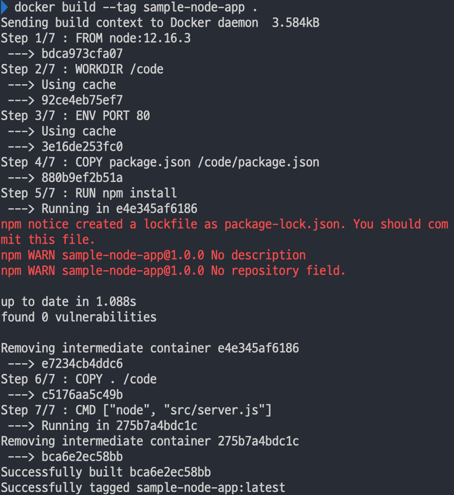
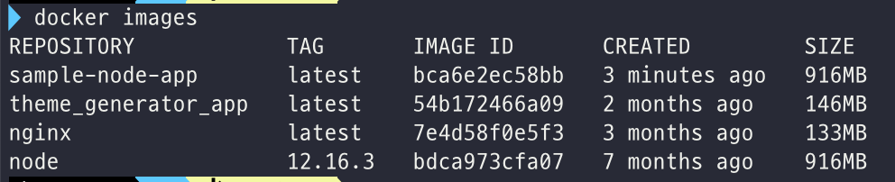

# 🐳 Docker ₩ Get Started

링크: https://docs.docker.com/get-started/

## [Part1. Orientation and setup](https://docs.docker.com/get-started/)

### DockerCon 2020 영상 [링크](https://youtu.be/iqqDU2crIEQ)

도커는 서버를 다루는 새로운 패러다임을 제시한다. 바로, 서버를 **Ephemeral** (단명한 것) 으로 보는 것. 서버가 죽거나,  장애가 생기면 patch나 update를 하는게 아니라 그냥 다른 이미지로 대체하면 된다.

도커에는 3단계가 있다.

1) Build Image - 어플리케이션이 동작하기 위해 필요한 모든 것을 consistently package한다.

2) Ship Image - build된 이미지를 클라우드나 로컬 개발 머신에서 runtime으로 ship한다.

3) Run Image - image를 가지고 편리하게 어플리케이션을 실행한다.

#### Dockerfile

`Dockerfile` 은 도커 이미지를 빌드하기 위해 사용된다. `Dockerfile` 은 도커 엔진으로 보내지는 명령어들의 조합이고, 도커 엔진은 이 명령어들을 위에서부터 하나씩 실행해 도커 이미지를 빌드한다.

```dockerfile
// 시작할 base image (verified) - 우리의 어플리케이션은 이 base image위에 쌓이게 된다
FROM node:12.16.3

// working directory - 이 디렉토리를 만들고 이후의 명령어들은 이 디렉토리를 기준으로 실행됨
WORKDIR /code

// PORT라는 환경변수를 만들고 그 값으로 80을 지정 - 이 이미지 내부의 모든 프로세스들이 접근할 수 있다
ENV PORT 80

// package.json 파일을 /code/package.json 으로 복사
COPY package.json /code/package.json

// 예
RUN npm install

// 현재 디렉토리(.)에 있는 모든 파일을 이미지(/code)로 복사
COPY . /code

// command - 도커 엔진이 컨테이너를 시작할 때 실행할 명령어들
CMD ["node", "src/server.js"]
```

#### Docker build

docker build와 관련된 명령어들은

```bash
docker build --help
# Usage:  docker build [OPTIONS] PATH | URL | -
```

이 명령어로 확인할 수 있다.

```
docker build --tag sample-node-app .
```

위 명령어를 실행하면 Dockerfile의 명령어들이 하나하나 실행되면서 도커 이미지가 만들어지는 것을 볼 수 있다.



로컬 머신에 있는 이미지들은 아래 명령어로 확인할 수 있다.

```
docker images
```



#### Docker run

이제 도커 이미지를 어떻게 만들지 알려주는 Dockerfile도 있고, 이 Dockerfile을 가지고 이미지를 build 했다. 이제 이 이미지를 run 하면 됨.

Docker run과 관련된 명령어들은 아래 명령어로 확인할 수 있다.

```bash
docker run --help
# Usage:  docker run [OPTIONS] IMAGE [COMMAND] [ARG...]
```

기본적으로 빌드하고 싶은 이미지의 이름을 넘겨주면 된다.

```
docker run sample-node-app
```

### Start the tutorial

```
docker run -d -p 80:80 docker/getting-started
```

`docker/getting-started` 이미지가 로컬에 존재하지 않으므로, docker hub라는 중앙 이미지 저장소에서 이미지를 내려받게 된다.

- `-d` : run the container in detached mode (in the background)
- `-p 80:80`: map port 80 of the host to port 80 in the container
- `docker/getting-started` : the image to use

위 명령어를 실행하고 나면, 도커 대시보드에서 이미지와, 실행중인 컨테이너를 확인할 수 있다.

#### 컨테이너란?

> a container is simply another process on your machine that has been isolated from all other processes on the host machine.

호스트 머신의 다른 모든 프로세스로부터 독립된 프로세스로, 내부적으로는 linux의 기능인 [kernel namespaces and cgroups](https://medium.com/@saschagrunert/demystifying-containers-part-i-kernel-space-2c53d6979504)를 사용한다.

#### 컨테이너 이미지란?

컨테이너를 run 할 때, 컨테이너는 독립된 filesystem을 이용한다. 이 독립된 filesystem은 컨테이너 이미지로부터 제공된다.

이미지는 컨테이너를 실행하기 위해 필요한 모든 것(all dependencies, configuration, scripts, binaries, etc.)들과, 필요한 환경설정(환경변수, 실행할 명령어, metadata 등)을 가지고 있다.
