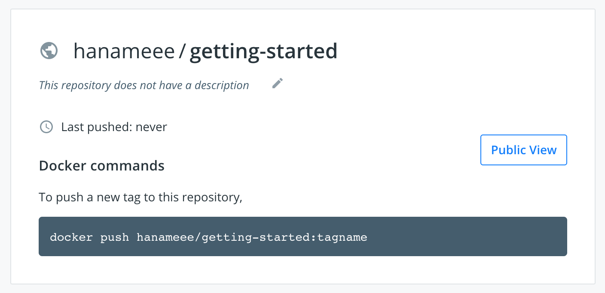
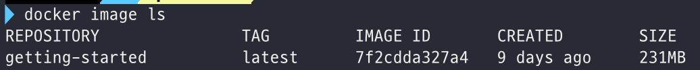

# 🐳 Docker 공식문서 Get Started

링크: https://docs.docker.com/get-started/

## [Part4. Sharing our Application](https://docs.docker.com/get-started/04_sharing_app/)

노드 패키지를 npm에 공유하듯, 도커 이미지는 Docker registry에 공유할 수 있다. 별도의 설정이 없다면 Docker registry의 기본값은 [docker hub](https://hub.docker.com/)이다. 빌드한 이미지를 docker hub에 공유해보자!

Docker hub에 가서 Repository를 만들면, 요런 안내문을 볼 수 있다.



`docker push 유저이름/getting-started:tagname` 명령어로 docker hub의 내 repo - 여기서는 getting-started - 에 이미지를 push 할 수 있다.

그런데, `docker image ls` 를 해보면, 로컬에 `hanameee/getting-started` 라는 이미지는 없다.



내 docker hub 레포에 이미지를 push 하기 위해서는 우리가 만든 저 `getting-started`를 **tag**해서   새로운 이름(`유저이름/getting-started`)을 부여해줘야 한다.

먼저 docker hub에 로그인을 한뒤 (`docker login -u 유저이름`)

```bash
docker tag getting-started 유저이름/getting-started
```

`docker tag 기존이미지이름 새이미지이름` 명령어로 새로운 이름이 부여된 이미지를 만들 수 있다.

그리고 push를 해주면

```bash
 docker push 유저이름/getting-started
```

원격 docker hub 레포에 이미지가 잘 올라가는 것을 확인할 수 있다.

이렇게 원격 docker hub에 이미지를 올리고 나면, 도커만 설치되어 있는 환경이라면 어디서든 방금 내가 올린 `hanameee/getting-started` 이미지를 내려받아 띄울 수 있다.

https://labs.play-with-docker.com/ 에서 실습해보자!

도커 계정으로 로그인 후, 해당 페이지의 터미널에서 아래 명령어로 docker run을 하면

```
docker run -dp 3000:3000 hanameee/getting-started
```

이미지가 docker hub에서 내려받아진 후 해당 서버의 3000포트로 띄워지는 것을 볼 수 있다. 넘나 재밌다...😳