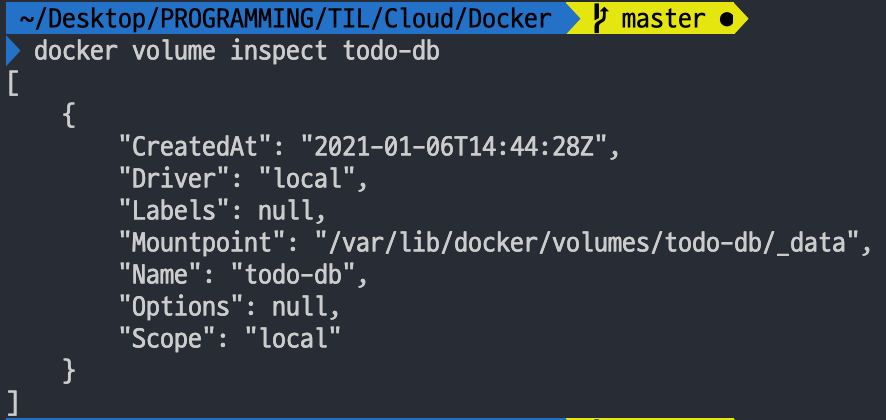

# 🐳 Docker 공식문서 Get Started

링크: https://docs.docker.com/get-started/

## [Part5. Persisting our DB](https://docs.docker.com/get-started/05_persisting_data/)

지금은 컨테이너를 띄울 때마다 리스트가 초기화된다. 왜 그럴까?

### 컨테이너의 파일시스템

컨테이너를 처음 띄우면, 이미지의 다양한 레이어를 바탕으로 해당 컨테이너의 파일시스템을 구성한다. (When a container runs, it uses the various layers from an image for its filesystem.) 그러나 컨테이너를 띄운 후의 변경사항은 해당 컨테이너 내에서만 유효하다. 

컨테이너들은 각자 파일 생성/수정/삭제를 위한 자신만의 scratch space를 가지기 때문에, 같은 이미지로 띄운 컨테이너들이라도 각자의 고유한 변경사항을 가지기 때문이다.

컨테이너는 이렇게 각자의 고유한 변경사항을 가지고, 컨테이너가 삭제되면 이 변경사항들도 사라진다. 

### Container volumes

Volumes를 이용하면, 컨테이너의 특정 파일시스템 경로를 호스트 머신과 연결할 수 있다. 컨테이너의 디렉토리가 변경되면, 그 변경사항이 호스트 머신에도 반영되는 것! 이후에 컨테이너가 재시작 될 때도 같은 디렉토리를 마운트(attach)하면, 변경사항을 계속해서 유지할 수 있다.

named volumes를 이용해 우리 todo app의 데이터를 유지해보자!

### 실습

1. volume을 생성한다.

   ```bash
   docker volume create todo-db
   ```

2. 기존에 컨테이너가 돌고 있었다면, 멈춰준다.

   ```bash
   docker rm -f <컨테이너아이디>
   ```

3. 컨테이너를 실행하되, `-v` 플래그로 volume mount를 명시해준다.

   ```bash
   docker run -dp 3000:3000 -v todo-db:/etc/todos hanameee/getting-started
   ```

4. 변경사항을 발생시키고 컨테이너를 삭제한다 (2번과 동일)
5. 3번과 동일한 명령어로 컨테이너를 실행한다

이렇게 volume을 이용해서 데이터를 보존할 수 있다.

### named volume의 데이터는 실제로 어디에 저장되는가?

`docker volume inspect <named-volume-이름>` 명령어를 통해 실제로 Docker이 volume의 데이터를 어디에 보관하는지 파악할 수 있다.



`Mountpoint` 에 나오는 경로가 그것인데, 실제로 터미널에서 해당 위치에 가보려고 하면 없는 경로다? 😳

그 이유는 내가 Docker for Mac 앱을 이용하고 있기 때문이다. 리눅스와는 달리, Docker는 macOS와 natively compatible 하지 않다. 사실 Docker는 내 호스트 머신이 아니라 호스트 머신 위의 가상환경에서 실행되고 있다는 사실...!

Docker Desktop for Mac은 [Hyperkit](https://github.com/moby/hyperkit)을 이용해 가상 이미지를 실행중인데, 가상 이미지 데이터는 `~/Library/Containers/com.docker.docker/Data/vms/0` 요기에 위치하고 있다.

우리는 이 가상 이미지를 실행시킨 후에, 저 위에 보이는 `Mountpoint` 경로를 들어가야 volume에 저장된 데이터를 볼 수 있는 것임!

```bash
$ screen ~/Library/Containers/com.docker.docker/Data/vms/0/tty 
```

(음... tty까지 실행은 시켰는데 이 이후에 Mountpoint로 navigate 하는게 안된다...😨 더 찾아봐야겠다아...이건 리눅스의 screen을 알아야 이해가 될 것 같음. 아이고 두야...)

출처: https://www.freecodecamp.org/news/where-are-docker-images-stored-docker-container-paths-explained/

### 예고) bind mounts

Docker engine은 대표적으로 두 종류의 volume을 지원하는데, 여기에는 방금 우리가 데이터를 유지하기 위해 사용한 **named volume**과 또 하나의 종류인 **bind mounts**가 있다.

우리가 Part3에서 어플리케이션에 발생한 수정사항을 반영하기 위해 이미지를 rebuild 했었다. 그런데, 어플리케이션에 변경사항이 생길때마다 수정사항을 반영한 이미지를 다시 빌드하는 것은 시간도 많이 걸리고 별로임. 여기서 bind mounts를 사용하면 좀 더 좋은 방법으로 어플리케이션을 업데이트 할 수 있다.

