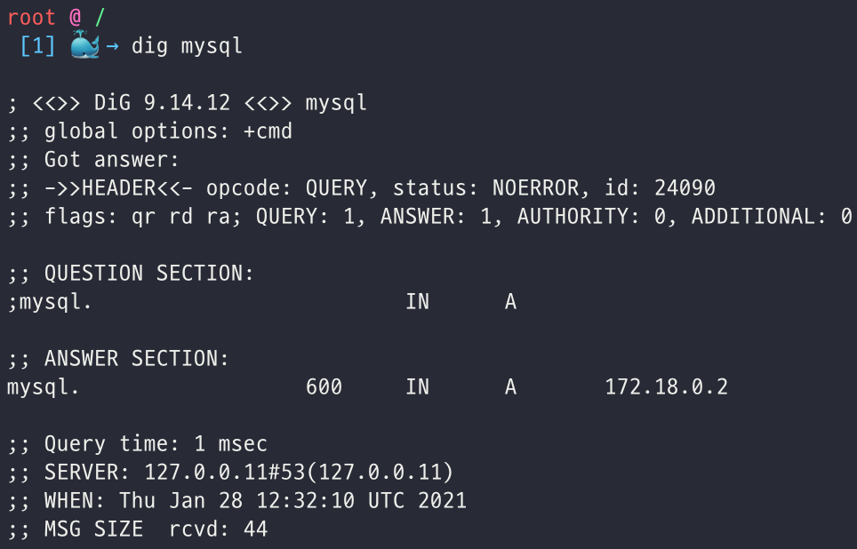
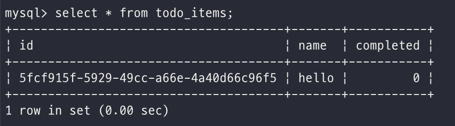

# 🐳 Docker 공식문서 Get Started

링크: https://docs.docker.com/get-started/

## [Part7. Multi container apps](https://docs.docker.com/get-started/07_multi_container/)

지금까지 우리는 한개의 컨테이너로 구동되는 어플리케이션(Todo App)을 가지고 실습을 해왔다! 이제 어플리케이션에 MySQL을 추가해보자.

MySQL을 어디에 추가해야 할까? Todo App과 같은 컨테이너? 아니면 별개의 컨테이너?

답은 "**별개의 컨테이너**" 로 띄운다 이다. 일반적으로, 한개의 컨테이너는 한가지 일만 잘 해야 한다.

- API랑 front-end의 스케일링은 DB의 스케일링과 따로 갈 가능성이 높다.
- 별도의 컨테이너로 관리해야 버전 업데이트를 독립적으로 할 수 있다.
- 한개의 컨테이너에는 원래 한개의 프로세스만 관리하는데, 여러개의 프로세스를 관리하는 것은 (프로세스 매니저 등의) 복잡도를 증가시킨다.
- 기타 등등... 많은 이유들...

### container networking

원래 컨테이너는 같은 host 머신에 떠 있어도 서로 완전 독립적으로 존재한다. 같은 머신에 있는 다른 프로세스나 컨테이너를 아예 모른다.

그렇다면, Todo App과 MySQL을 별도의 컨테이너로 띄웠을 때 그 둘을 어떻게 소통시킬까? 답은 **Networking**! 두 개의 컨테이너가 같은 network에 있다면, 그 둘은 서로 소통할 수 있다.

### MySQL 컨테이너 띄우기

1. network를 생성하자.

   ````bash
   docker network create todo-app
   ````

2. MySQL 컨테이너를 생성하고 network에 붙이자. DB를 초기화하기 위한 환경변수도 flag로 넣어주고, named volume도 붙여주자. (`docker volume create` 명령어 없이도 도커는 우리가 named volume을 사용한 것을 알고 자동으로 만들어준다)

   ```bash
   docker run -d \
        --network todo-app --network-alias mysql \
        -v todo-mysql-data:/var/lib/mysql \
        -e MYSQL_ROOT_PASSWORD=secret \
        -e MYSQL_DATABASE=todos \
        mysql:5.7
   ```

3. MySQL 컨테이너가 잘 떴나 확인하자.

   ```bash
   docker exec -it <mysql-container-id> mysql -p
   ```

4. password를 입력하고 (위 예제의 경우 secret) MySQL shell이 뜨면 아래의 명령어로 todos database를 확인하자.

   ```mysql
   mysql> SHOW DATABASES;
   ```

### MySQL에 연결하기

MySQL 컨테이너를 todo-app 네트워크에 띄우긴 띄웠는데, 이제 어떻게 todo-app 네트워크 상의 컨테이너들이 서로 소통하게 할까? (ps.컨테이너들은 고유한 IP 주소를 갖는다.)

networking issues를 다루는데 도움을 주는 [nicolaka/netshoot](https://github.com/nicolaka/netshoot)을 사용해서 실습을 해보자!

1. nicolaka/netshoot 이미지를 이용해서 todo-app 네트워크에 컨테이너를 띄운다. 

   ```bash
   docker run -it --network todo-app nicolaka/netshoot
   ```

2. 컨테이너를 띄운 뒤 DNS 도구인 아래 명령어로 호스트이름이 mysql인 IP 주소를 확인하자.

   ```bash
   dig mysql
   ```

   

ANSWER SECTION을 보면 mysql에 대한  `A` 레코드의 IP 주소를 볼 수 있다. 즉, Docker은 mysql이라는 이름만을 가지고도 IP 주소를 파악할 수 있다는 말이므로 - Todo App은 이 mysql에만 connect 하면 된다.

참고로 여기서 mysql을 hostname으로 사용할 수 있는 이유는, MySQL 컨테이너 띄울 때 `--network-alias mysql` 을 설정해줬기 때문이다 :D

### Todo App와 MySQL 연결하기

기존의 Todo App을 MySQL과 연결하기 위해 몇가지 환경변수를 설정해줘야 한다.

- `MYSQL_HOST` - 떠있는 MySQL 서버의 hostname

- `MYSQL_USER` - the username to use for the connection

- `MYSQL_PASSWORD` - the password to use for the connection

- `MYSQL_DB` - the database to use once connected

위 환경변수 값을 같이 넘겨서 todo-app 컨테이너를 띄워보자! 기존 todo app의 root 폴더에서 아래 명령어를 실행한다.

```bash
 docker run -dp 3000:3000 \
   -w /app -v "$(pwd):/app" \
   --network todo-app \
   -e MYSQL_HOST=mysql \
   -e MYSQL_USER=root \
   -e MYSQL_PASSWORD=secret \
   -e MYSQL_DB=todos \
   node:12-alpine \
   sh -c "yarn install && yarn run dev"
```

컨테이너 로그를 확인해보면 (`docker logs <container-id>`) 이렇게 mysql db와 연결된 것을 확인할 수 있다!

이제 3000포트로 접속해 todo app에서 항목을 입력한 뒤, 띄워놓은 mysql 컨테이너에서 todo_items를 조회해보면

```bash
docker exec -it 074e113351f7 mysql -p todos
```

```sql
select * from todo_items;
```



이렇게 DB에 잘 들어가있는 것을 볼 수 있다! :happy: 우왕! 신기해!

