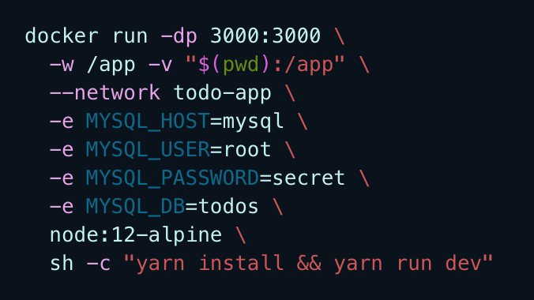
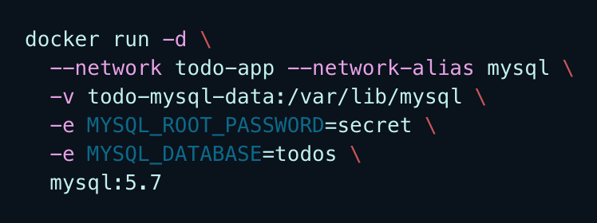
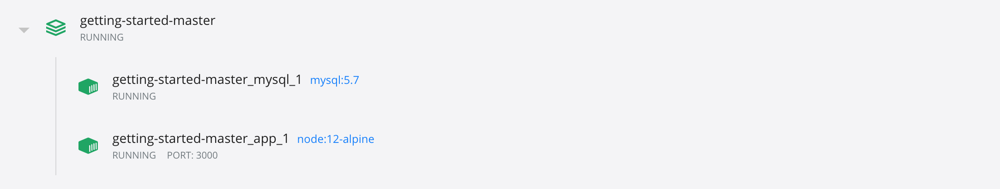

# 🐳 Docker 공식문서 Get Started

링크: https://docs.docker.com/get-started/

## [Part8. Using Docker Compose](https://docs.docker.com/get-started/08_using_compose/)

지금까지 todo-app 노드 웹앱과, mysql 서버를 각각 같은 네트워크에 띄웠다. 그런데 그 띄우는 과정에서 명령어가 엄청 길고, 복잡했다 !_!

| 컨테이너 | 명령어                                                       |
| -------- | ------------------------------------------------------------ |
| todo-app |  |
| mysql    |  |

그래서 사용할 수 있는 것이 **Docker Compose**!

[Docker Compose](https://docs.docker.com/compose/)는 multi-container 앱을 정의하고 공유하는 것을 돕기 위해 만들어진 툴이다. YAML 파일로 서비스를 정의하고, 간단한 명령어 하나로 서비스를 띄우거나 내리거나 할 수 있다.

Docker Compose를 이용하면 무엇보다도 어플리케이션 스택을 파일로 관리할 수 있다는 점이 좋다! 이 파일을 project repo의 root 폴더에 위치시켜서 version control을 할 수도 있고, 사람들이 쉽게 레포를 내려받아서 명령어 하나로 compose app을 띄울 수도 있다:star2:

### Docker Compose 설치하기

나는 Docker Desktop for Mac을 설치했기에 이미 Docker Compose가 깔려있다. (If you installed Docker Desktop/Toolbox for either Windows or Mac, you already have Docker Compose)

Docker Compose가 깔려있다면 아래 명령어로 버전 확인 가능!

```bash
docker-compose version
```

안깔려있다면 [the instructions here](https://docs.docker.com/compose/install/)!

### Compose File 생성하기

app project의 **root 폴더**에 `docker-compose.yml` 파일을 만들자. 쉽게 생각하면, 위에 우리가 컨테이너를 띄우기 위해 작성했던 긴 명령어들을 yaml 파일에 정리한다고 보면 된다.

> docker-compse.yml

```yml
version: "3.7" # docker-compose schema 버전

services: # services - application에 포함된 서비스들(containers)을 정의
  app: # service name - 이 이름은 자동으로 network alias가 됨
    image: node:12-alpine # 컨테이너 이미지 정의
    command: sh -c "yarn install && yarn run dev" # 관습적으로 이미지 필드 밑줄에 명령어를 적는다
    ports: # 서비스 포트 정의
      - 3000:3000
    working_dir: /app # -w /app 을 정의
    volumes: # volumes 정의 (:는 path 구분자로 호스트의 ./를 컨테이너의 /app 디렉토리와 공유한다는 의미) bind mount를 해준 것.
      - ./:/app
    environment: # 환경변수 정의
      MYSQL_HOST: mysql
      MYSQL_USER: root
      MYSQL_PASSWORD: secret
      MYSQL_DB: todos

  mysql:
    image: mysql:5.7
    volumes:
      - todo-mysql-data:/var/lib/mysql # 여기는 named volume 정ㅇ의
    environment:
      MYSQL_ROOT_PASSWORD: secret
      MYSQL_DATABASE: todos

volumes: # docker run에서는 named volume을 자동으로 만들어줬지만, docker-compose에서는 명시적으로 volume을 정의해줘야 한다.
  todo-mysql-data: # volume 이름만 써줘도 default 옵션 값이 지정되므로 OK
```

### Application Stack Run하기

이제 프로젝트의 root 디렉토리에 `docker-compose.yml` 파일이 준비되었으니, 띄우면 된다!

```bash
docker-compose up -d # -d는 background에서 돌리기
```

이렇게 띄운 뒤, 아래 명령어로 실시간 log를 볼 수 있다.

```bash
docker-compose logs -f
```

Docker Dashboard 앱에서 확인해보면



이렇게 `docker-compose.yml` 파일이 위치한 루트 디렉토리의 이름과 동일한 이름(getting-started-master)의 그룹이 떠있는게 보이고, 그 그룹을 펼쳐보면  `<project-name>_<service-name>_<replica-number>` 형식의 앱들이 떠있는게 보인다.

`docker-compose down` 명령어로 이 두 앱을 쉽게 내리고, `docker-compose up` 명령어로 쉽게 띄울 수 있다.

:warning: 앱 스택을 삭제한다고 해서, named volumes까지 삭제되는 것은 아니다. volumes까지 제거하고 싶다면 `--volumes` 플래그까지 붙여서 `docker-compose down --volumes` 명령어를 줘야 함.

긴긴 명령어를 다 입력하던 시절은 빠이빠이...! 🥳