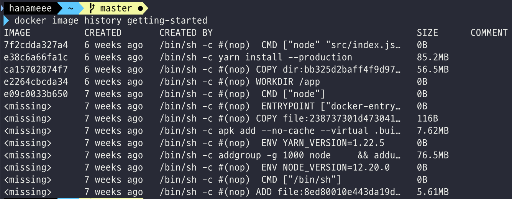

# 🐳 Docker 공식문서 Get Started

링크: https://docs.docker.com/get-started/

## [Part9. Image-building best practices](https://docs.docker.com/get-started/09_image_best/)

이미지 빌드할때 자주 사용되는 best practice에 대해 알아보자😎

### Security scanning

`docker scan` 명령어를 통해 이미지 빌드 후 보안 상 취약점을 점검할 수 있다. 도커는 [Snyk](http://snyk.io/) 플랫폼과 파트너를 맺어서 scanning service를 제공한다.

```bash
docker scan getting-started
```

docker scan에 대한 더 자세한 정보는 [docker scan documentation](https://docs.docker.com/engine/scan/)에서 확인!

### image layering

도커 이미지는 여러개의 레이어로 이루어져 있다. `docker image history` 명령어를 이용하면 이미지의 레이어를 구성하는데에 쓰인 명령어들을 파악할 수 있다.



모든 명령어를 보려면 `--no-trunc` 플래그를 넘겨주면 된다.

### Layer caching

레이어링의 원리를 알았으니, 컨테이너 이미지 빌드 시간을 줄일 수 있는 방법에 대해 알아보자!

기본적으로 레이어가 변경되면, 모든 하위 레이어는 다시 만들어져야 한다.

[기존 Dockerfile]

```dockerfile
FROM node:12-alpine
WORKDIR /app
COPY . .
RUN yarn install --production
CMD ["node", "src/index.js"]
```

각 명령어는 이미지의 새로운 레이어를 만든다. 만약 `/app`  하위 소스코드에 변경사항이 생긴다면, `yarn install -...` 을 통해 설치되는 dependencies 들도 모두 다시 설치되어야 한다. (동일한 의존성임에도 불구하고)

이걸 고치려면 Dockerfile을 재구조화하면 된다.

[재구조화한 Dockerfile]

먼저 `package.json` 을 copy하고, 의존성을 설치하고, 그리고 나머지 소스코드를 (`/app`) copy한다면? 그렇다면 package.json에 변경이 생겼을 때만 `yarn install` 을 다시 해서 의존성을 재설치할 수 있다.

1. Dockerfile 수정

```dockerfile
 FROM node:12-alpine
 WORKDIR /app
 COPY package.json yarn.lock ./
 RUN yarn install --production
 COPY . .
 CMD ["node", "src/index.js"]
```

2. `.dockerignore` 에 node_modules 추가

이미지와 무관한 파일들은 dockerignore에 추가해서 copy에서 생략할 수 있다. node app에서는 `node_modules` 가 그 예.

yarn install에서 설치한 의존성 파일을 node_modules가 override 할 수 있으므로 dockerignore에 추가해준다.

이렇게 수정한 뒤 `docker build -t getting-started .` 로 이미지를 최초 빌드하고 (이땐 dockerfile에 수정이 있었으므로 모든 레이어가 rebuild 된다), 이후 html 파일 등에 수정을 한 후 다시 이미지를 빌드해보면...! 😲


`COPY . .` 전의 모든 레이어들은 다 cache를 사용하는 것을 볼 수 있다! 이미지 빌드 속도가 훨씬 빨라졌다.

build cache를 사용하므로, 이미지 pushing, pulling, update 모두가 다 훨씬 빨라진다.

### Multi-stage builds

이미지를 생성하기 위해 여러 단계가 필요할 때, `multi-stage builds`는 강력한 도구이다!

Multi-stage build의 이점은 다음과 같다.

- runtime 의존성과 별개의 build-time 의존성 관리
- 오직 **앱이 run 하는데에 필요한** 의존성만 shipping 하여 전체적인 이미지 사이즈의 감소

[React 예제]

리액트 앱을 빌드할때는 js,jsx,sass 등을 정적인 HTML, JS, CSS 등으로 컴파일 하기 위해 Node 개발환경이 필요하다.

하지만 production에는 node 환경이 필요하지 않다. 예를 들어, ngnix 컨테이너에는 빌드 결과물인 static resource만 포함되면 된다.

따라서 아래처럼 dockerfile을 작성할 수 있다.

```dockerfile
FROM node:12 AS build
WORKDIR /app
COPY package* yarn.lock ./
RUN yarn install
COPY public ./public
COPY src ./src
RUN yarn run build

FROM nginx:alpine
COPY --from=build /app/build /usr/share/nginx/html
```

`FROM node:12 AS build` 에서 node:12 이미지를 build에 사용하고, 빌드 결과물만을 nginx 컨테이너에 copy 하는 것.