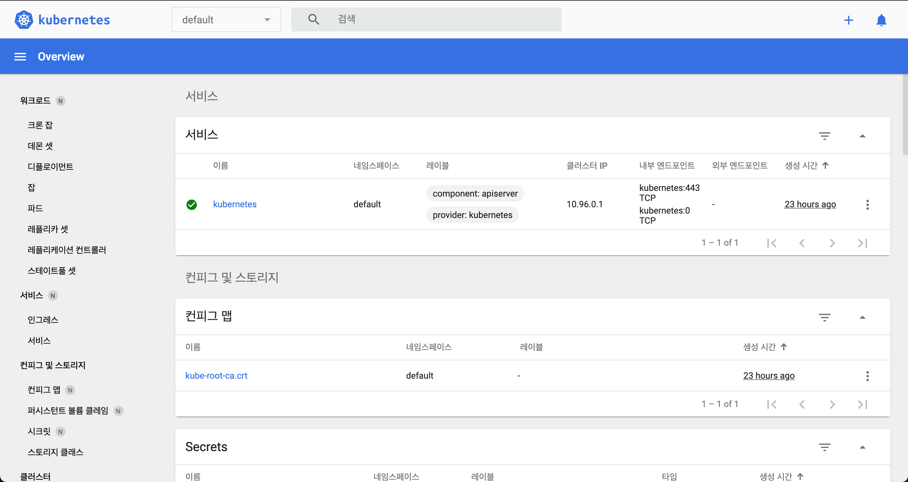
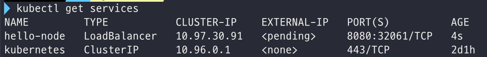
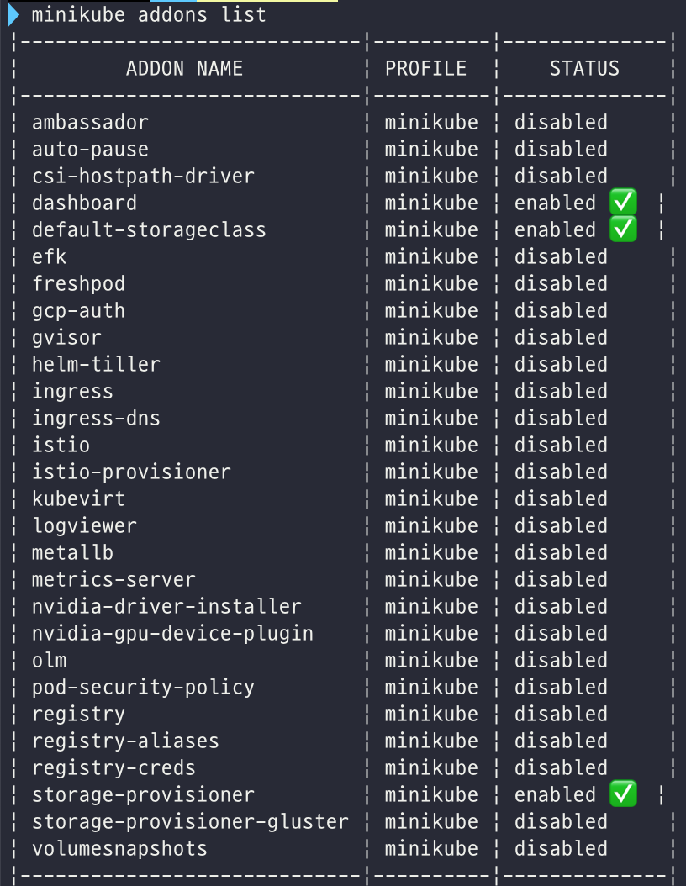

# 쿠버네티스 공식 홈페이지 튜토리얼

링크: https://kubernetes.io/ko/docs/tutorials/

## Hello Minikube

**minikube**를 이용해서 로컬 환경에서 쿠버네티스에서 샘플 애플리케이션을 실행해보자 :D

minikube란? **로컬 환경에서 쿠버네티스 환경을 제공**하는 프로젝트 명이자 프로그램 이름! 쿠버네티스 클러스터는 마스터 노드와 하나 이상의 워커 노드로 구성되어 있기에, 단순 개발 테스트 목적으로 개인이 쿠버네티스 플랫폼을 구성하는 것은 쉽지 않다. 이에 **마스터 노드의 일부 기능과, 개발 및 배포를 위한 단일 워커 노드를 제공해주는 간단한 쿠버네티스 플랫폼 환경**이 바로 minikube이다. [출처](https://m.blog.naver.com/PostView.nhn?blogId=sharplee7&logNo=221737855770&proxyReferer=https:%2F%2Fwww.google.com%2F)

> Minikube는 가벼운 쿠버네티스 구현체이며, 로컬 머신에 VM을 만들고 하나의 노드로 구성된 간단한 클러스터를 생성한다. Minikube는 리눅스, 맥, 그리고 윈도우 시스템에서 구동이 가능하다. Minikube CLI는 클러스터에 대해 시작, 중지, 상태 조회 및 삭제 등의 기본적인 부트스트래핑(bootstrapping) 기능을 제공한다. [출처](https://kubernetes.io/ko/docs/tutorials/kubernetes-basics/create-cluster/cluster-intro/)

### minikube 클러스터 만들기

`minikube start` 로 minikube를 실행한다.

`minikube dashboard` 로 로컬에서 **쿠버네티스 대시보드**를 열 수 있다. `minikube dashboard`  명령을 내리면 대시보드 애드온과 프록시가 활성화되고, 해당 프록시로 접속하는 기본 웹 브라우저 창이 열린다.



대시보드에서는 디플로이먼트나 서비스 같은 쿠버네티스 자원을 생성할 수 있다.

`Ctrl+C` 를 눌러 프록시를 종료할 수 있고, 자동으로 웹 브라우저가 열리는 것을 원치 않는다면, `minikube dashboard --url` 명령어를 실행하여 대시보드 접속 URL을 출력할 수 있다.

### 디플로이먼트(Deployment) 만들기

**Pod**는 관리,네트워킹 목적으로 함께 묶여있는 하나 이상의 **컨테이너 그룹**이다. (튜토리얼의 pod에는 하나의 컨테이너만 있다)

**Deployment**는 pod의 헬스를 검사해서, pod의 컨테이너가 종료되었다면 재시작해준다. Pod의 생성 및 스케일링을 관리하는 방법으로 Deployment를 권장한다.

- Deployment 만들기 - `kubectl create` 명령어로 pod를 관리할 Deployment를 만든다. 이 pod는 제공된 도커 이미지를 기반으로 한 컨테이너를 실행한다.

   ```shell
   kubectl create deployment hello-node --image=k8s.gcr.io/echoserver:1.4
   ```

- Deployment 보기

   ```shell
   kubectl get deployments
   ```

- Pod 보기

   ```shell
   kubectl get pods
   ```

- 클러스터 이벤트 보기

   ```shell
   kubectl get events
   ```

- `kubectl` 환경설정 보기

   ```shell
   kubectl config view
   ```

### 서비스 (Service) 만들기

기본적으로 Pod는 쿠버네티스 클러스터 내부에서만 유효한 내부 IP 주소를 가진다. 우리가 위에서 만들어본 `hello-node` 컨테이너를 쿠버네티스 가상 네트워크 외부에서 접근하려면, pod를 **쿠버네티스 서비스**로 노출해야 한다.

[참고 - 쿠버네티스 서비스의 타입]

서비스는 IP 주소 할당 방식과 연동 서비스등에 따라 크게 4가지로 구별할 수 있다.

- Cluster IP: default 값으로, 서비스에 **클러스터 내부 IP를 할당**한다. 쿠버네티스 클러스터 내에서는 이 서비스에 접근이 가능하지만, 외부 IP를 할당 받지 못했기 때문에 클러스터 외부에서는 접근이 불가능하다.
- Load Balancer: 외부 IP를 가지고 있는 로드밸런서를 할당한다. 클러스터 외부에서 접근이 가능하다.
- NodePort: 클러스터 IP 뿐만 아니라, 모든 노드의 IP와 포트를 통해 접근이 가능하다.
- ExternalName: 외부 서비스를 쿠버네티스 내부에서 호출하고자 할 때 사용할 수 있다. 쿠버네티스 클러스터 내의 pod들은 클러스터 IP를 가지고 있기에, 클러스터 IP 대역 밖의 서비스를 호출하고자 하면 NAT 설정 등 복잡한 설정이 필요하다. 이를 쉽게 해결해줄 수 있는 방법이 ExternalName인데, 클러스터로 들어오는 모든 요청을 특정 주소로 포워딩 해줄 수 있는 - 일종의 프록시와 같은 역할을 한다.

출처: https://bcho.tistory.com/1262


- `kubectl expose` 명령어로 퍼블릭 인터넷에 pod 노출하기

   ```shell
   kubectl expose deployment hello-node --type=LoadBalancer --port=8080
   # 여기서는 LoadBalancer 타입을 사용해 클러스터 밖의 서비스로 노출했다.
   # 튜토리얼에서 컨테이너를 만들기 위해 사용된 이미지(k8s.gcr.io/echoserver) 내의 애플리케이션 코드는 TCP 포트 8080에서만 수신하기에, 만약 kubectl expose를 사용해 8080이 아닌 다른 포트를 노출했다면, 클라이언트는 해당 포트에 연결할 수 없다.
   ```


- 생성한 서비스 보기

  ```shell
  kubectl get services
  ```



LoadBalancer을 지원하는 클라우드 프로바이더의 경우, 서비스에 접근할 수 있는 외부 IP가 프로비저닝 되었을 것. 하지만 우리는 minikube를 이용해 실습하고 있으므로, minikube에서의 LoadBalancer타입은 `minikube service` 명령어를 통해 서비스에 접근할 수 있게끔 해준다.
- 생성한 서비스를 통해 브라우저에 앱 띄우기

  ```shell
  minikube service hello-node
  ```


## addons 사용하기

minikube에는 로컬 쿠버네티스 환경에서 접속해볼 수 있는 내장 애드온 셋이 포함되어 있다.

- 현재 지원하는 애드온 목록을 확인하기

  ```shell
  minikube addons list
  ```




- 애드온 활성화/비활성화 (i.e. metrics-server)

  ```shell
  minikube addons enable metrics-server # 활성화
  minikube addons disable metrics-server # 비활성화
  ```

## 제거하기


- 클러스터에서 만들어진 리소스 (i.e. service, deployment) 제거하기

  ```shell
  kubectl delete service hello-node
  kubectl delete deployment hello-node
  ```
  
- minikube 가상머신 정지하기

  ```shell
  minikube stop
  ```
  
- minikube 가상머신 삭제하기

  ```shell
  minikube delete
  ```