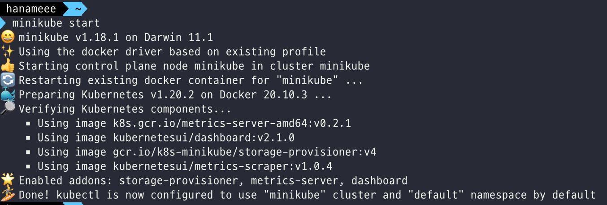
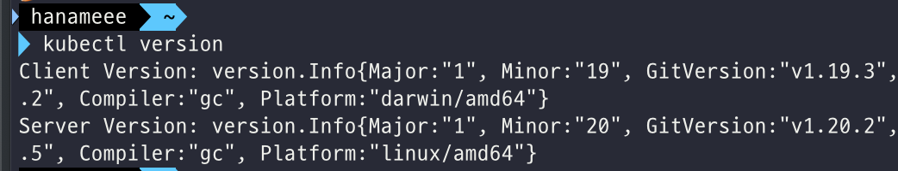
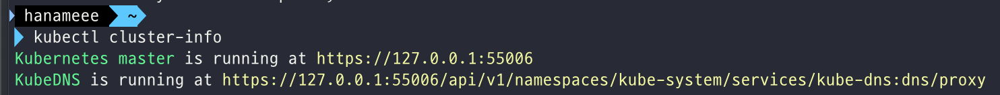
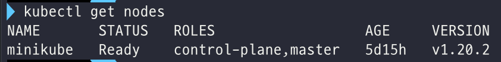

# 쿠버네티스 기초 학습

링크: https://kubernetes.io/ko/docs/tutorials/kubernetes-basics/

## 1. [Create a Cluster](https://kubernetes.io/docs/tutorials/kubernetes-basics/create-cluster/)

### 쿠버네티스 클러스터란?

쿠버네티스는 컴퓨터들을 연결하여 **단일 형상으로 동작하도록 컴퓨팅 클러스터를 구성**하고, 높은 가용성을 제공하도록 조율한다. 이런 쿠버네티스의 추상화 개념 덕분에 사용자는 개별 머신에 얽매이지 않고 **컨테이너화된 애플리케이션을 클러스터에 배포**할 수 있다.

쿠버네티스는 클러스터 컨테이너화된 애플리케이션을 실행하는 **노드**라고 하는 워커 머신의 집합이다. 클러스터는 아래 2가지 형태의 자원으로 구성되며, 모든 클러스터는 최소 한 개의 워커 노드를 가진다

- 컨트롤 플레인: 워커 노드와 클러스터 내 파드를 관리한다. 
- 노드: 애플리케이션을 구동하는 worker이다.


출처: https://kubernetes.io/ko/docs/concepts/overview/components/

#### 컨트롤 플레인

컨트롤 플레인은 **클러스터 관리**를 담당한다.

- 애플리케이션 스케줄링
- 애플리케이션 항상성 유지
- 애플리케이션 스케일링, 새로운 변경사항 순서대로 반영(rolling out) 등...

이렇게 컨트롤 플레인은 클러스터 내 모든 활동을 조율하고, 실행 중인 애플리케이션을 호스팅하기 위해 사용되는 노드와 클러스터를 관리한다.

#### 노드

노드는 쿠버네티스 **클러스터 내에서 워커 머신으로 동작하는 VM 또는 물리적인 컴퓨터**다.

각 노드는 Kubelet이라는 - 노드를 관리하고 쿠버네티스 컨트롤 플레인과 통신하는 - 에이전트를 갖는다. 노드는 컨테이너 운영을 담당하는 툴도 (i.e. containerd, 도커) 갖는다. 운영 트래픽을 처리하는 쿠버네티스 클러스터는 최소 세 대의 노드를 가져야 한다.


쿠버네티스에 애플리케이션을 배포할 때는, control plane에게 어플리케이션 컨테이너를 시작하라고 지시하면 된다. 그럼 control plane이 컨테이너를 어느 클러스터의 노드에 구동시킬지 스케줄한다.

노드는 **control plane이 제공하는 [쿠버네티스 API](https://kubernetes.io/ko/docs/concepts/overview/kubernetes-api/)**를 통해 컨트롤 플레인과 통신한다. 최종 사용자도 쿠버네티스 API를 사용해 클러스터와 직접 상호작용 할 수 있다.

쿠버네티스 클러스터는 물리/가상 머신 모두에 설치할 수 있다.

하지만 우리는 Minikube가 설치된 온라인 터미널로 실습해볼 것. 가벼운 쿠버네티스 구현체인 Minikube는 로컬 머신에 VM을 생성하고, 한개의 노드로 구성된 간단한 클러스터를 생성한다. 

----

### 실습

```shell
minikube version # minikube 버전 확인 
minikube start # Minikube로 쿠버네티스 클러스터가 구동되어 있는 vm을 시작한다.
```



```shell
kubectl version # 쿠버네티스 cli인 kubectl (자세한건 나중에!) 버전 확인
```



Client, Server 버전을 모두 볼 수 있다. Client Version은 kubectl 버전을 의미하고, Server Version은 마스터에 설치된 쿠버네티스 버전을 의미한다. 빌드에 대한 정보도 볼 수 있음.

```shell
kubectl cluster-info # 쿠버네티스 클러스터 정보 확인
```


```shell
kubectl get nodes # 쿠버네티스 클러스터에 있는 노드 정보 확인
```



애플리케이션을 호스트 하기 위해 사용될 수 있는 모든 노드를 보여준다. Minikube에서는 오직 하나의 node만 있어서 위의 사진과 같은 값이 나옴.
