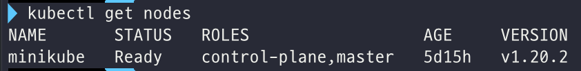

# 쿠버네티스 기초 학습

링크: https://kubernetes.io/ko/docs/tutorials/kubernetes-basics/

## 2. [Deploy an App](https://kubernetes.io/docs/tutorials/kubernetes-basics/deploy-app/)

### kubectl을 사용해서 디플로이먼트 생성하기

#### 쿠버네티스 디플로이먼트란?

쿠버네티스 클러스터 위에 컨테이너화된 애플리케이션을 배포하기 위해서, 쿠버네티스 **디플로이먼트** 설정을 만들어야 한다. 

디플로이먼트는 쿠버네티스가 애플리케이션의 인스턴스를 **어떻게 생성하고 업데이트해야 하는지**를 지시한다.

디플로이먼트가 만들어지면 쿠버네티스 **컨트롤 플레인**이 해당 디플로이먼트에 포함된 애플리케이션 인스턴스가 클러스터의 개별 노드에서 실행되도록 스케줄링한다.

애플리케이션 인스턴스가 생성되고 나면, **쿠버네티스 디플로이먼트 컨트롤러**는 계속해서 해당 인스턴스를 모니터링한다. 만약 인스턴스를 호스팅하고 있는 노드가 다운되거나 삭제되면, 디플로이먼트 컨트롤러는 해당 인스턴스를 클러스터 내의 다른 노드의 인스턴스로 교체한다. 이렇게 머신의 장애/정비에 대응할 수 있는 self-healing 메커니즘이 가능해진다.

#### 쿠버네티스에 첫 번째 애플리케이션 배포하기

`kubectl` 이라는 쿠버네티스 CLI를 통해 디플로이먼트를 생성하고 관리할 수 있다. kubectl은 클러스터와 상호작용하기 위해 쿠버네티스 API를 사용한다. 이번 모듈에서는 가장 자주 쓰이는 kubectl 명령어를 배울 것!

Deployment를 생성할 때는 아래의 것들을 명시해주어야 한다.

- 애플리케이션에 대한 컨테이너 이미지
- 실행하고 싶은 replica의 수

위 정보들은 Deployment 업데이트를 통해 변경할 수 있다.

애플리케이션을 쿠버네티스에 배포하기 위해서는 애플리케이션이 지원되는 컨테이너 형식으로 패키징 되어야 한다. 이 튜토리얼에서는 [Hello Minikube tutorial](https://kubernetes.io/docs/tutorials/hello-minikube/) 에서 만들었던 hello-node 애플리케이션을 사용해 배포해 볼 것임. hello-node는 nginx를 사용해 모든 요청을 echo하는 도커 컨테이너로 패키지한 애플리케이션!

---

### 실습

```shell
kubectl version # kubectl 버전 확인
```

kubectl의 명령어는 일반적으로 kubectl [action] [resource]의 형태이다. 가능한 파라미터에 대한 정보를 얻으려면 --help 옵션을 추가하면 된다.

```shell
kubectl get nodes # 클러스터 내의 노드들 확인
```



쿠버네티스는 이 사용가능한 노드 리소스를 바탕으로 애플리케이션을 어디에 배포할지 선택한다.

```shell
kubectl create deployment kubernetes-bootcamp --image=gcr.io/google-samples/kubernetes-bootcamp:v1
```

쿠버네티스에 앱을 배포하기 위해서는 `kubectl create deployment` 커맨드로 deployment를 생성할 수 있다. 위 명령어에서 볼 수 있듯이 deployment 이름과, 앱 이미지 위치를 파라미터로 넘겨주어야 한다.

deployment를 생성하면 아래와 같은 일들이 자동으로 일어난다.

- 애플리케이션의 인스턴스를 실행할 수 있는 적합한 node를 찾는다.
- 애플리케이션이 해당 노드에서 실행되도록 스케줄한다.
- 필요하다면 새로운 노드의 인스턴스를 스케줄링하도록 클러스터를 설정한다.

```shell
kubectl get deployments # deployments 확인
```

deployment는 앱의 인스턴스를 실행시킨다. 이 인스턴스는 노드 내부의 도커 컨테이너에서 실행되는중!
