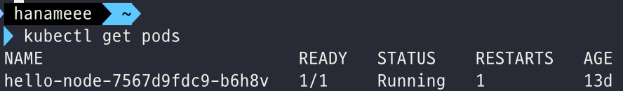
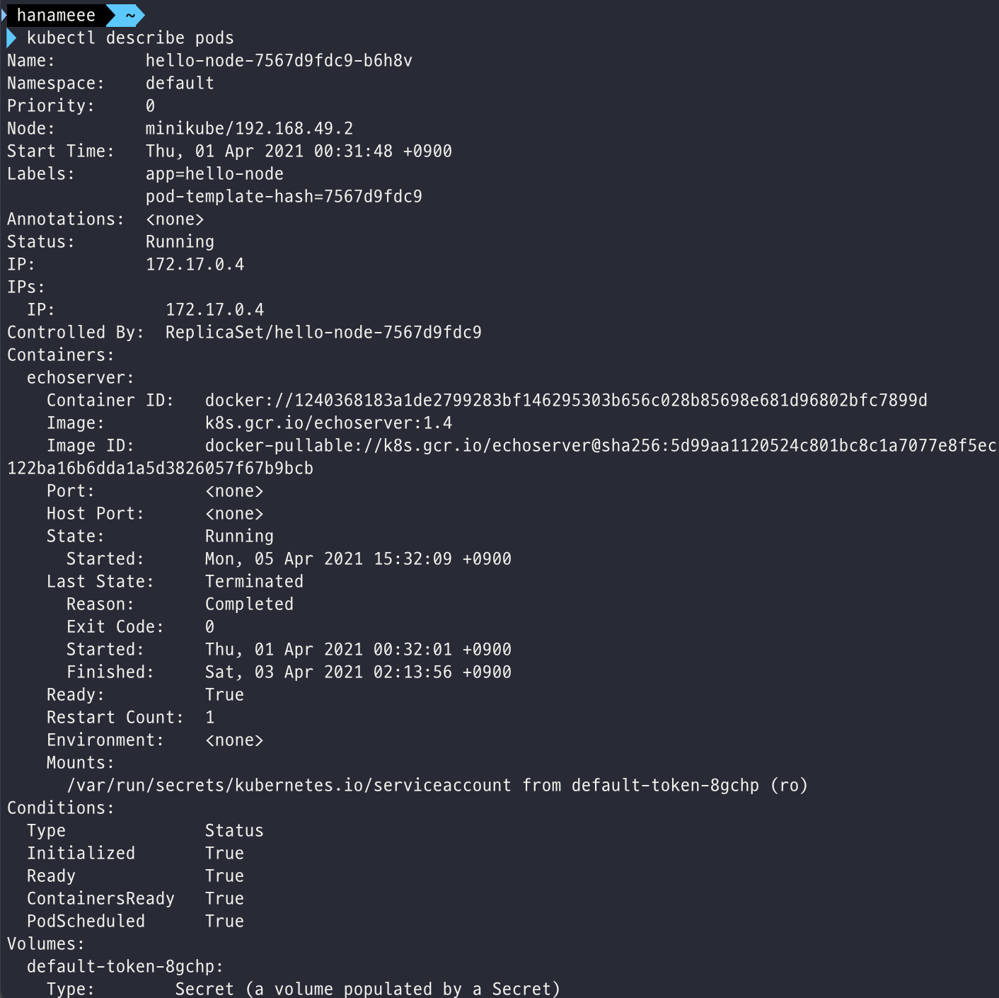
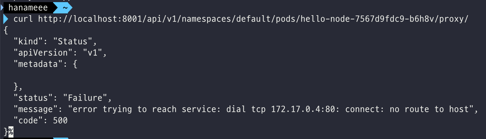
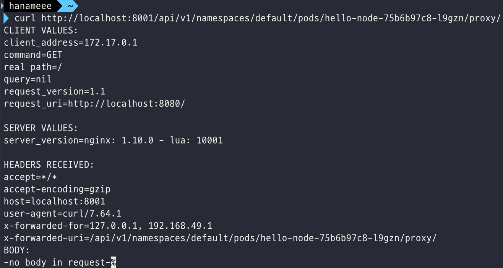
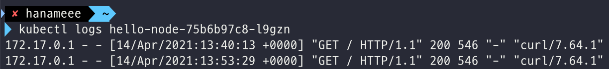
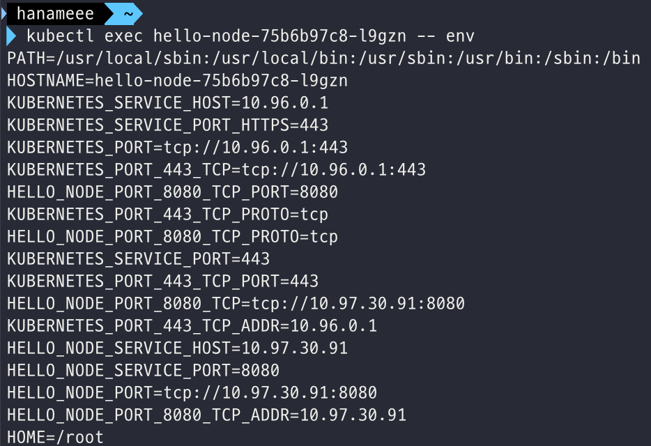
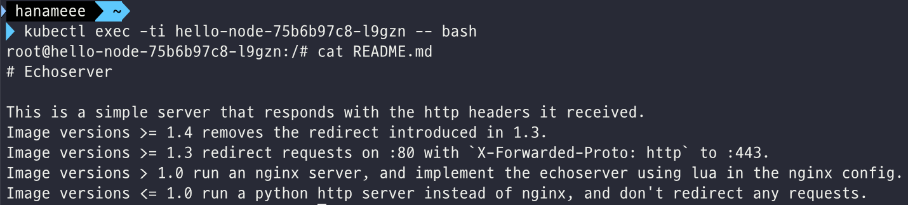

# 쿠버네티스 기초 학습

링크: https://kubernetes.io/ko/docs/tutorials/kubernetes-basics/

## 3. [Explore Your App](https://kubernetes.io/docs/tutorials/kubernetes-basics/explore/)

### 파드와 노드 보기

#### 쿠버네티스 Pod란?

위에서 Deployment를 생성했을 때, 쿠버네티스는 앱의 인스턴스를 호스트하기 위해 **Pod**를 생성했다. Pod란 하나 이상의 애플리케이션 컨테이너(i.e. Docker)들의 그룹과, 해당 컨테이너들 간에 공유되는 자원들을 나타내는 k8s의 추상적 개념(abstraction)이다.

컨테이너들 간에 공유되는 자원들에는 아래와 같은 것들이 있다.

- Volumes와 같은 Shared storage
- unique cluster IP address와 같은 Networking
- 컨테이너 이미지 버전이나, 사용할 특정 포트와 같은 각 컨테이너가 동작하는 방식에 대한 정보

Pod는 애플리케이션 전용(specific)의 "logical host"를 모델링한다. Pod는 상대적으로 밀접하게 결합되어 있는 서로다른 애플리케이션 컨테이너(i.e. Node.js 앱 + Node.js 웹서버에 의해 발행되는 데이터를 공급하는 컨테이너)를 포함할 수 있다. 위에 나왔듯이 Pod 내의 컨테이너는 IP 주소와 Port space를 공유하고, 항상 co-located, co-scheduled 되며, 동일 노드 상의 shared context에서 동작한다.

또한 Pod는 쿠버네티스 플랫폼 상에서의 **최소 단위**이다. 우리가 k8s에서 Deployment를 생성하면, Deployment는 container(들)을 바로 생성하는게 아니라, **container(들)을 가진 Pod를 생성**한다. 각 Pod는 스케줄된 Node에 tied 되며, (재구동 정책에 의해) 종료되거나 삭제되기 전까지 유지된다. Node Failure의 경우엔 동일한 Pod들이 클러스터 내의 다른 사용가능한 Node들에 스케줄링된다.


만약 서로 다른 컨테이너들이 서로 밀접하게 결합되어 있고, 디스크와 같은 자원을 공유해야 한다면? 그 컨테이너들은 하나의 Pod에 함께 스케줄되어야 한다.

#### 쿠버네티스 노드(Node)란?

Pod는 항상 Node 상에서 동작한다. Node란 k8s의 **워커 머신**이고, 클러스터에 따라 가상 또는 물리 머신일 수 있다. 각 Node는 마스터에 의해 관리된다.

하나의 노드 내에서는 여러 Pods들이 실행될 수 있고, k8s 마스터가 자동으로 클러스터 내의 노드들에 pods를 스케줄링한다. 이런 마스터의 자동 스케줄링은 각 노드의 사용가능한 자원을 고려해서 이루어진다.

모든 k8s 쿠버네티스 노드는 최소한 아래의 것들을 실행한다.

- **kubelet** : 쿠버네티스 마스터와 노드 간의 커뮤니케이션을 담당하는 프로세스. 머신에서 구동되는 Pods와 컨테이너들을 관리하는 역할을 한다
- **컨테이너 런타임** (i.e. Docker) : 레지스트리에서 컨테이너 이미지를 pull해오고, 컨테이너를 unpacking하고, 어플리케이션을 구동하는 역할을 한다.


#### kubectl로 트러블슈팅하기

가장 많이 쓰이는 kubectl 커맨드(의 일부)는 아래와 같다.

- **kubectl get** [리소스] - 리소스들의 목록 보여주기
- **kubectl describe** [리소스] - 리소스와 관련된 자세한 정보 보여주기
- **kubectl logs** - pod 내의 컨테이너의 로그 출력하기
- **kubectl exec** - pod 내의 컨테이너에서 명령어 실행하기

---

### 실습

#### Step 1. Check application configuration

```shell
kubectl get pods # 지금 존재하는 파드들 확인하기
```



Pod에 어떤 컨테이너가 있고, 그 컨테이너들을 빌드하기 위해 어떤 이미지들이 사용되었는지를 보려면 `describe pods` 명령어를 쓴다.

```shell
kubectl describe pods
```



Pod의 컨테이너에 대한 자세한 정보를 볼 수 있다. 

Describe 명령어는 비단 pod 뿐만 아니라, node, deployments 등 대부분의 쿠버네티스 리소스의 세부 정보를 얻기 위해 사용된다.

#### Step 2. Show the app in the terminal

Pods는 분리된 private 네트워크에서 작동한다. 따라서 pod에 접근해서 상호작용하고 디버깅 하기 위해서는 proxy access가 필요하다.

이를 위해서 우리는 `kubectl proxy` 명령어를 사용해 proxy를 실행할 것.

```shell
kubectl proxy
```

proxy를 통해 pod에 query 하기 전, 우선 Pod 이름을 받아와보자! 아래는 Pod 이름을 받아와서 이를 POD_NAME environment variable에 저장하는 명령어이다.

```shell
export POD_NAME=$(kubectl get pods -o go-template --template '{{range .items}}{{.metadata.name}}{{"\n"}}{{end}}')
echo Name of the Pod: $POD_NAME
```

위에서 얻은 환경변수 값을 가지고 `curl`  요청을 날려보자.

```shell
curl http://localhost:8001/api/v1/namespaces/default/pods/$POD_NAME/proxy/
```

⚠️ 요 에러와 관련해서: Deployment에 8080으로 포트 지정을 해줘야 함. (https://github.com/kubernetes/website/issues/18079) Interactive tutorial에서는 이걸 어디선가 자동으로 해주나본데 local에서 직접 실습할 때는 

```shell
kubectl edit deployment/hello-node
```

로 들어가서 직접 port 정보를 추가해줘야함! 위 링크 참고.



아무튼, curl 요청을 날려보면 이렇게 응답이 잘 오는걸 볼 수 있다.



#### Step 3. View the container logs

애플리케이션에서 `STDOUT` 으로 전송하는 모든 것은 컨테이너의 로그가 된다. 아래 명령어로 파드 내 컨테이너의 로그들을 확인할 수 있다. 

```shell
kubectl logs $POD_NAME # 실습에서는 Pod 내에 컨테이너가 하나 뿐이므로 컨테이너 이름을 명시해주지 않아도 된다.
# $POD_NAME 환경변수에 pod 이름 들어있다고 가정
```



#### Step 4. Executing command on the container

⚠️ 아래 명령어들에서 컨테이너 이름이 생략된 이유는 Pod 내에 컨테이너가 하나 뿐이어서임을 명심!

Pod가 떠있으면 `exec` 커맨드를 이용해서 컨테이너에 직접적으로 명령어를 실행할 수 있다.

```shell
kubectl exec $POD_NAME -- env
```




bash 세션을 시작해보자!
```shell
kubectl exec --ti $POD_NAME -- bash
```



이제 우리는 Pod 내의 컨테이너에서 bash를 실행하고 있는 것! 여기서 `curl localhost:8080` 을 해보면 애플리케이션이 잘 떠있는 것을 확인할 수 있다. (launching command within the Pod 이기에 가능한것)