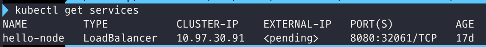
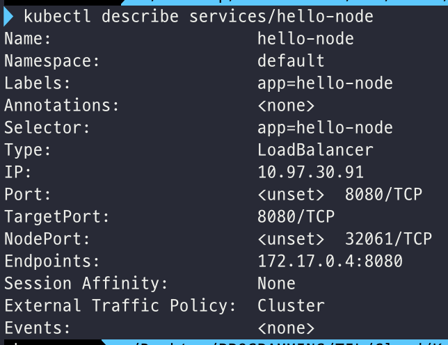
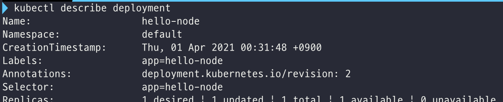

# 쿠버네티스 기초 학습

링크: https://kubernetes.io/ko/docs/tutorials/kubernetes-basics/

## 5. [Scale Your App](https://kubernetes.io/docs/tutorials/kubernetes-basics/scale/)

### 복수의 앱 인스턴스를 구동하기

쿠버네티스 Pod들은 lifecycle을 가진다. 즉, mortal하므로 언젠간 죽게 된다. 워커 노드가 죽으면, 해당 노드 상에서 동작하는 Pod들 또한 죽게 된다! 이렇게 Pod가 죽더라도 Replicaset은 새로운 Pod들을 생성해서 동적으로 클러스터를 기존 상태로 되돌려줄 수 있다.

그런데 **k8s 클러스터 내에서 각 Pod는 유일한 IP 주소**를 가진다. 동일한 Node 상의 Pod여도 그 IP 주소가 다 다르며, 재생성 된 Pod들도 역시 다른 IP 주소를 가진다. 따라서 Pod들이 재생성되는 변화 사이에서도 애플리케이션이 지속적으로 기능할 수 있도록, 이를 조정해주는 방법이 있어야 하는데 이 역할을 **Service**가 해준다!

#### Service란?

k8s에서 서비스는 하나의 논리적인 set of Pods와, 그 Pods에 접근할 수 있는 정책을 정의하는 추상적 개념이다. 서비스는 종속적인 Pod들이 서로 느슨하게 결합되도록 해주며, 다른 k8s object들처럼 YAML (또는 JSON)으로 정의된다.

서비스가 대상으로 하는 set of Pods는 보통 `LabelSelector`에 의해 결정된다. (spec에 selector이 포함되지 않는 경우도 있다 - 아래에 나옴)

#### Service Type

각 Pod들이 고유한 IP를 가지고 있지만 이는 오직 클러스터 내부에서 접근 가능한 IP이다. Pod를 외부트래픽에 노출시키려면 Service가 필요하다.

**ServiceSpec**에 다양한 Service의 `type`을 지정함으로써 Pod들을 다양한 방식으로 노출시킬 수 있다.

|                    |                                                              |
| ------------------ | ------------------------------------------------------------ |
| ClusterIP (기본값) | 클러스터 내부 IP에 대해 서비스를 노출해줌. 클러스터 내부에서만 Service에 접근할 수 있음. |
| NodePort           | NAT를 사용해 Service를 **클러스터 내의 선택된 각 노드들의 동일한 port**로 노출해줌. `<NodeIP>:<NodePort>`를 통해 클러스터 외부에서 서비스로 접근할 수 있음. |
| LoadBalancer       | (지원 가능하다면) 기존 클라우드에서 외부용 로드밸런서를 생성해 Service에 고정된 공인 IP를 할당한다. |
| ExternalName       | `CNAME` 레코드와 값을 반환함으로써 Service를 `externalName` 필드의 내용 (i.e. foo.bar.example.com)에 매핑한다. 어떠한 proxy도 설정되지 않으며, `kube-dns` v1.7이상 또는 CoreDNS 버전 0.0.8 이상이 필요하다. |

스펙에 `selector` 을 정의하지 않는 Services의 usecase도 있다. `selector` 없이 만들어진 Service는 상응하는 엔드포인트 객체를 생성하지 않는데, 이 덕에 유저는 특정 엔드포인트에 Service를 매핑시킬 수 있다. 혹은 `type: ExternalName` 을 반드시 사용할 때 selector을 생략할 수 있다.

### Service와 Lables

서비스는 set of Pods에 걸쳐서 트래픽을 라우트한다. Service라는 abstration 덕분에 pod가 죽거나, 복제되더라도 애플리케이션에 영향이 없다! 애플리케이션의 FE-BE 컴포넌트처럼 의존적인 Pods들 간의 Discovery와 routing 역시 Service에 의해 처리된다.

Service는 [labels and selectors](https://kubernetes.io/docs/concepts/overview/working-with-objects/labels) (k8s의 객체들에 대한 logical operation을 허용해주는 grouping primitive) 이용해서 set of Pods를 매치시킨다. **Labels**는 objects에 붙여지는 key-value 쌍인데, 아래와 같은 역할들을 할 수 있다.

- dev, test, production에 대해 objects를 지정
- embed version tag
- tags를 이용해 object를 분류


Lables는 object의 생성 시점 또는 이후 시점에 붙여질 수 있고, 언제든지 수정이 가능하다.

---

### 실습

#### Step 1 Create a new service

```shell
kubectl get pods # 현재 돌고 있는 pods 확인
kubectl get services
```



사진에서 보이는 service는 minicube가 클러스터를 시작했을 때 생성된 것!

새로운 service를 생성하고, 이를 외부 트래픽에 노출시키기 위해서는 `NodePort`나 `LoadBalancer` 옵션을 사용한다. NodePort로 노출시키는 예시는 아래와 같다

```shell
kubectl expose deployment/hello-node --type="NodePort" --port 8080
```

만약 어떤 Port가 외부로 노출되었는지를 확인하고 싶다면 아래와 같은 명령어를 사용할 수 있다.

```shell
kubectl describe services/hello-node
```



#### Step 2: Using labels

Deployment가 우리 Pod에 label을 자동으로 생성해서 붙여주었다. 이 label은 아래의 명령어로 확인할 수 있다.

```shell
kubectl describe deployment
```



`app=hello-node`라는 라벨이 붙은 걸 볼 수 있다!

이 Label을 사용해서 list of Pods를 쿼리할 수 있다. 이때는 `-l` 옵션을 이용한다.

```shell
kubectl get pods -l app=hello-node # pods를 쿼리할 수도
kubectl get services -l app=hello-node # services를 쿼리할 수도
```

Pod 이름을 저장한 후 POD_NAME 환경변수에 저장해두자.

```shell
export POD_NAME=$(kubectl get pods -o go-template --template '{{range .items}}{{.metadata.name}}{{"\n"}}{{end}}')
echo Name of the Pod: $POD_NAME
```

아래와 같이 label을 간단하게 추가할 수 있다.

```shell
kubectl label pod $POD_NAME version=v1
# kubectl label <Object Type> <Object Name> <New Label key=value>
```

추가한 라벨은 `describe` 명령어로 확인할 수 있다.

```shell
kubectl describe pods $POD_NAME
kubectl get pods -l version=v1 # 새로운 라벨로 pods를 쿼리할 수 있다.
```

#### Step 3 Deleting a service

마찬가지로 라벨을 사용해 서비스를 삭제할 수 있다.

```shell
kubectl delete service -l app=hello-node
```

삭제 후에는 아래와 같은 방법으로 확인해서 클러스터 외부에서 더 이상 앱이 접근 가능하지 않음을 확인한다.

```shell
kubectl get services # service가 삭제된 것을 확인
curl $(minikube ip):$NODE_PORT # NODE_PORT 환경변수가 있다고 가정했을 때 - 이전에 노출된 IP+port로 curl을 해봐서 route가 더 이상 노출되지 않음을 확인
```

다만, 서비스 삭제 후에도 여전히 pod 내에서는 app이 작동한다. Deployment가 여전히 앱을 관리하고 있기 때문이다. 아래와 같은 명령어로 확인할 수 있다.

```shell
kubectl exec -ti $POD_NAME -- curl localhost:8080
```

앱을 삭제하려면 Service 뿐만 아니라 Deployment까지 삭제해야 함을 알 수 있다.

