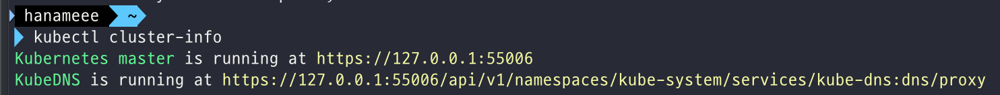

# 쿠버네티스 기초 학습

링크: https://kubernetes.io/ko/docs/tutorials/kubernetes-basics/

## 쿠버네티스 기초

쿠버네티스 클러스터 오케스트레이션 시스템의 기초를 익힐 수 있는 튜토리얼.

Katacoda를 사용해 웹 브라우저에서 Minikube가 동작하는 가상 터미널을 구동한다. 아래와 같은 내용들에 대해 배울 것.

- 컨테이너화된 애플리케이션을 클러스터에 배포하기
- 디플로이먼트를 스케일링하기
- 컨테이너화된 애플리케이션을 새로운 소프트웨어 버전으로 업데이트하기
- 컨테이너화된 애플리케이션을 디버그하기

## 클러스터 생성하기

### 쿠버네티스 클러스터란?

쿠버네티스는 컴퓨터들을 연결하여 **단일 형상으로 동작하도록 컴퓨팅 클러스터를 구성**하고, 높은 가용성을 제공하도록 조율한다. 이런 쿠버네티스의 추상화 개념 덕분에 사용자는 개별 머신에 얽매이지 않고 **컨테이너화된 애플리케이션을 클러스터에 배포**할 수 있다.

쿠버네티스는 클러스터 컨테이너화된 애플리케이션을 실행하는 **노드**라고 하는 워커 머신의 집합이다. 클러스터는 아래 2가지 형태의 자원으로 구성되며, 모든 클러스터는 최소 한 개의 워커 노드를 가진다

- 컨트롤 플레인: 워커 노드와 클러스터 내 파드를 관리한다. 
- 노드: 애플리케이션을 구동하는 worker이다.


출처: https://kubernetes.io/ko/docs/concepts/overview/components/

#### 컨트롤 플레인

컨트롤 플레인은 **클러스터 관리**를 담당한다.

- 애플리케이션 스케줄링
- 애플리케이션 항상성 유지
- 애플리케이션 스케일링, 새로운 변경사항 순서대로 반영(rolling out) 등...

이렇게 컨트롤 플레인은 클러스터 내 모든 활동을 조율하고, 실행 중인 애플리케이션을 호스팅하기 위해 사용되는 노드와 클러스터를 관리한다.

#### 노드

노드는 쿠버네티스 **클러스터 내에서 워커 머신으로 동작하는 VM 또는 물리적인 컴퓨터**다.

각 노드는 Kubelet이라는 - 노드를 관리하고 쿠버네티스 컨트롤 플레인과 통신하는 - 에이전트를 갖는다. 노드는 컨테이너 운영을 담당하는 툴도 (i.e. containerd, 도커) 갖는다. 운영 트래픽을 처리하는 쿠버네티스 클러스터는 최소 세 대의 노드를 가져야 한다.


쿠버네티스에 애플리케이션을 배포할 때는, control plane에게 어플리케이션 컨테이너를 시작하라고 지시하면 된다. 그럼 control plane이 컨테이너를 어느 클러스터의 노드에 구동시킬지 스케줄한다.

노드는 **control plane이 제공하는 [쿠버네티스 API](https://kubernetes.io/ko/docs/concepts/overview/kubernetes-api/)**를 통해 컨트롤 플레인과 통신한다. 최종 사용자도 쿠버네티스 API를 사용해 클러스터와 직접 상호작용 할 수 있다.

쿠버네티스 클러스터는 물리/가상 머신 모두에 설치할 수 있다.

하지만 우리는 Minikube가 설치된 온라인 터미널로 실습해볼 것. 가벼운 쿠버네티스 구현체인 Minikube는 로컬 머신에 VM을 생성하고, 한개의 노드로 구성된 간단한 클러스터를 생성한다. 

----

### 실습

```shell
minikube version # minikube 버전 확인 
minikube start # Minikube로 쿠버네티스 클러스터가 구동되어 있는 vm을 시작한다.
```


```shell
kubectl version # 쿠버네티스 cli인 kubectl (자세한건 나중에!) 버전 확인
```


Client, Server 버전을 모두 볼 수 있다. Client Version은 kubectl 버전을 의미하고, Server Version은 마스터에 설치된 쿠버네티스 버전을 의미한다. 빌드에 대한 정보도 볼 수 있음.

```shell
kubectl cluster-info # 쿠버네티스 클러스터 정보 확인
```


```shell
kubectl get nodes # 쿠버네티스 클러스터에 있는 노드 정보 확인
```


애플리케이션을 호스트 하기 위해 사용될 수 있는 모든 노드를 보여준다. Minikube에서는 오직 하나의 node만 있어서 위의 사진과 같은 값이 나옴.

## 앱 배포하기

### kubectl을 사용해서 디플로이먼트 생성하기

#### 쿠버네티스 디플로이먼트란?

쿠버네티스 클러스터 위에 컨테이너화된 애플리케이션을 배포하기 위해서, 쿠버네티스 **디플로이먼트** 설정을 만들어야 한다. 

디플로이먼트는 쿠버네티스가 애플리케이션의 인스턴스를 **어떻게 생성하고 업데이트해야 하는지**를 지시한다.

디플로이먼트가 만들어지면 쿠버네티스 **컨트롤 플레인**이 해당 디플로이먼트에 포함된 애플리케이션 인스턴스가 클러스터의 개별 노드에서 실행되도록 스케줄링한다.

애플리케이션 인스턴스가 생성되고 나면, **쿠버네티스 디플로이먼트 컨트롤러**는 계속해서 해당 인스턴스를 모니터링한다. 만약 인스턴스를 호스팅하고 있는 노드가 다운되거나 삭제되면, 디플로이먼트 컨트롤러는 해당 인스턴스를 클러스터 내의 다른 노드의 인스턴스로 교체한다. 이렇게 머신의 장애/정비에 대응할 수 있는 self-healing 메커니즘이 가능해진다.

#### 쿠버네티스에 첫 번째 애플리케이션 배포하기

`kubectl` 이라는 쿠버네티스 CLI를 통해 디플로이먼트를 생성하고 관리할 수 있다. kubectl은 클러스터와 상호작용하기 위해 쿠버네티스 API를 사용한다. 이번 모듈에서는 가장 자주 쓰이는 kubectl 명령어를 배울 것!

Deployment를 생성할 때는 아래의 것들을 명시해주어야 한다.

- 애플리케이션에 대한 컨테이너 이미지
- 실행하고 싶은 replica의 수

위 정보들은 Deployment 업데이트를 통해 변경할 수 있다.

애플리케이션을 쿠버네티스에 배포하기 위해서는 애플리케이션이 지원되는 컨테이너 형식으로 패키징 되어야 한다. 이 튜토리얼에서는 [Hello Minikube tutorial](https://kubernetes.io/docs/tutorials/hello-minikube/) 에서 만들었던 hello-node 애플리케이션을 사용해 배포해 볼 것임. hello-node는 nginx를 사용해 모든 요청을 echo하는 도커 컨테이너로 패키지한 애플리케이션!

---

### 실습

```shell
kubectl version # kubectl 버전 확인
```

kubectl의 명령어는 일반적으로 kubectl [action] [resource]의 형태이다. 가능한 파라미터에 대한 정보를 얻으려면 --help 옵션을 추가하면 된다.

```shell
kubectl get nodes # 클러스터 내의 노드들 확인
```


쿠버네티스는 이 사용가능한 노드 리소스를 바탕으로 애플리케이션을 어디에 배포할지 선택한다.

```shell
kubectl create deployment kubernetes-bootcamp --image=gcr.io/google-samples/kubernetes-bootcamp:v1
```

쿠버네티스에 앱을 배포하기 위해서는 `kubectl create deployment` 커맨드로 deployment를 생성할 수 있다. 위 명령어에서 볼 수 있듯이 deployment 이름과, 앱 이미지 위치를 파라미터로 넘겨주어야 한다.

deployment를 생성하면 아래와 같은 일들이 자동으로 일어난다.

- 애플리케이션의 인스턴스를 실행할 수 있는 적합한 node를 찾는다.
- 애플리케이션이 해당 노드에서 실행되도록 스케줄한다.
- 필요하다면 새로운 노드의 인스턴스를 스케줄링하도록 클러스터를 설정한다.

```shell
kubectl get deployments # deployments 확인
```

deployment는 앱의 인스턴스를 실행시킨다. 이 인스턴스는 노드 내부의 도커 컨테이너에서 실행되는중!

## 앱 조사하기

### 파드와 노드 보기

#### 쿠버네티스 Pod란?

위에서 Deployment를 생성했을 때, 쿠버네티스는 앱의 인스턴스를 호스트하기 위해 **Pod**를 생성했다. Pod란 하나 이상의 애플리케이션 컨테이너(i.e. Docker)들의 그룹과, 해당 컨테이너들 간에 공유되는 자원들을 나타내는 k8s의 추상적 개념(abstraction)이다.

컨테이너들 간에 공유되는 자원들에는 아래와 같은 것들이 있다.

- Volumes와 같은 Shared storage
- unique cluster IP address와 같은 Networking
- 컨테이너 이미지 버전이나, 사용할 특정 포트와 같은 각 컨테이너가 동작하는 방식에 대한 정보

Pod는 애플리케이션 전용(specific)의 "logical host"를 모델링한다. Pod는 상대적으로 밀접하게 결합되어 있는 서로다른 애플리케이션 컨테이너(i.e. Node.js 앱 + Node.js 웹서버에 의해 발행되는 데이터를 공급하는 컨테이너)를 포함할 수 있다. 위에 나왔듯이 Pod 내의 컨테이너는 IP 주소와 Port space를 공유하고, 항상 co-located, co-scheduled 되며, 동일 노드 상의 shared context에서 동작한다.

또한 Pod는 쿠버네티스 플랫폼 상에서의 **최소 단위**이다. 우리가 k8s에서 Deployment를 생성하면, Deployment는 container(들)을 바로 생성하는게 아니라, **container(들)을 가진 Pod를 생성**한다. 각 Pod는 스케줄된 Node에 tied 되며, (재구동 정책에 의해) 종료되거나 삭제되기 전까지 유지된다. Node Failure의 경우엔 동일한 Pod들이 클러스터 내의 다른 사용가능한 Node들에 스케줄링된다.


만약 서로 다른 컨테이너들이 서로 밀접하게 결합되어 있고, 디스크와 같은 자원을 공유해야 한다면? 그 컨테이너들은 하나의 Pod에 함께 스케줄되어야 한다.

#### 쿠버네티스 노드(Node)란?

Pod는 항상 Node 상에서 동작한다. Node란 k8s의 **워커 머신**이고, 클러스터에 따라 가상 또는 물리 머신일 수 있다. 각 Node는 마스터에 의해 관리된다.

하나의 노드 내에서는 여러 Pods들이 실행될 수 있고, k8s 마스터가 자동으로 클러스터 내의 노드들에 pods를 스케줄링한다. 이런 마스터의 자동 스케줄링은 각 노드의 사용가능한 자원을 고려해서 이루어진다.

모든 k8s 쿠버네티스 노드는 최소한 아래의 것들을 실행한다.

- **kubelet** : 쿠버네티스 마스터와 노드 간의 커뮤니케이션을 담당하는 프로세스. 머신에서 구동되는 Pods와 컨테이너들을 관리하는 역할을 한다
- **컨테이너 런타임** (i.e. Docker) : 레지스트리에서 컨테이너 이미지를 pull해오고, 컨테이너를 unpacking하고, 어플리케이션을 구동하는 역할을 한다.


#### kubectl로 트러블슈팅하기

가장 많이 쓰이는 kubectl 커맨드(의 일부)는 아래와 같다.

- **kubectl get** [리소스] - 리소스들의 목록 보여주기
- **kubectl describe** [리소스] - 리소스와 관련된 자세한 정보 보여주기
- **kubectl logs** - pod 내의 컨테이너의 로그 출력하기
- **kubectl exec** - pod 내의 컨테이너에서 명령어 실행하기

