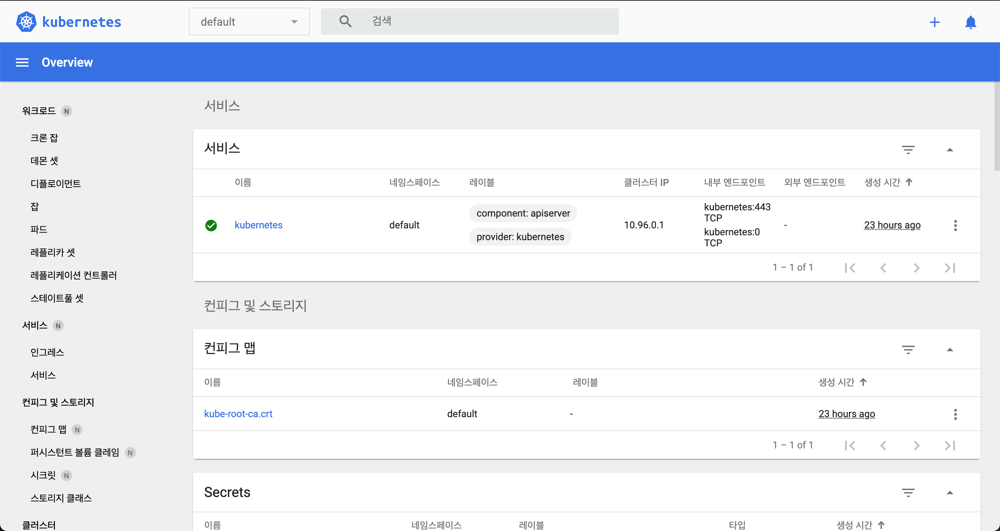

# 쿠버네티스 공식 홈페이지 튜토리얼

링크: https://kubernetes.io/ko/docs/tutorials/

## Hello Minikube

**minikube**를 이용해서 로컬 환경에서 쿠버네티스에서 샘플 애플리케이션을 실행해보자 :D

minikube란? **로컬 환경에서 쿠버네티스 환경을 제공**하는 프로젝트 명이자 프로그램 이름! 쿠버네티스 클러스터는 마스터 노드와 하나 이상의 워커 노드로 구성되어 있기에, 단순 개발 테스트 목적으로 개인이 쿠버네티스 플랫폼을 구성하는 것은 쉽지 않다. 이에 **마스터 노드의 일부 기능과, 개발 및 배포를 위한 단일 워커 노드를 제공해주는 간단한 쿠버네티스 플랫폼 환경**이 바로 minikube이다. [출처](https://m.blog.naver.com/PostView.nhn?blogId=sharplee7&logNo=221737855770&proxyReferer=https:%2F%2Fwww.google.com%2F)

> Minikube는 가벼운 쿠버네티스 구현체이며, 로컬 머신에 VM을 만들고 하나의 노드로 구성된 간단한 클러스터를 생성한다. Minikube는 리눅스, 맥, 그리고 윈도우 시스템에서 구동이 가능하다. Minikube CLI는 클러스터에 대해 시작, 중지, 상태 조회 및 삭제 등의 기본적인 부트스트래핑(bootstrapping) 기능을 제공한다. [출처](https://kubernetes.io/ko/docs/tutorials/kubernetes-basics/create-cluster/cluster-intro/)

### minikube 클러스터 만들기

`minikube start` 로 minikube를 실행한다.

`minikube dashboard` 로 로컬에서 **쿠버네티스 대시보드**를 열 수 있다. `minikube dashboard`  명령을 내리면 대시보드 애드온과 프록시가 활성화되고, 해당 프록시로 접속하는 기본 웹 브라우저 창이 열린다.



대시보드에서는 디플로이먼트나 서비스 같은 쿠버네티스 자원을 생성할 수 있다.

`Ctrl+C` 를 눌러 프록시를 종료할 수 있고, 자동으로 웹 브라우저가 열리는 것을 원치 않는다면, `minikube dashboard --url` 명령어를 실행하여 대시보드 접속 URL을 출력할 수 있다.

### 디플로이먼트(Deployment) 만들기

**Pod**는 관리,네트워킹 목적으로 함께 묶여있는 하나 이상의 **컨테이너 그룹**이다. (튜토리얼의 pod에는 하나의 컨테이너만 있다)

**Deployment**는 pod의 헬스를 검사해서, pod의 컨테이너가 종료되었다면 재시작해준다. Pod의 생성 및 스케일링을 관리하는 방법으로 Deployment를 권장한다.

- Deployment 만들기 - `kubectl create` 명령어로 pod를 관리할 Deployment를 만든다. 이 pod는 제공된 도커 이미지를 기반으로 한 컨테이너를 실행한다.

```bash
kubectl create deployment hello-node --image=k8s.gcr.io/echoserver:1.4
```

- Deployment 보기

```bash
kubectl get deployments
```

- Pod 보기

   ```shell
   kubectl get pods
   ```

- 클러스터 이벤트 보기

   ```shell
   kubectl get events
   ```

- `kubectl` 환경설정 보기

   ```shell
   kubectl config view
   ```
