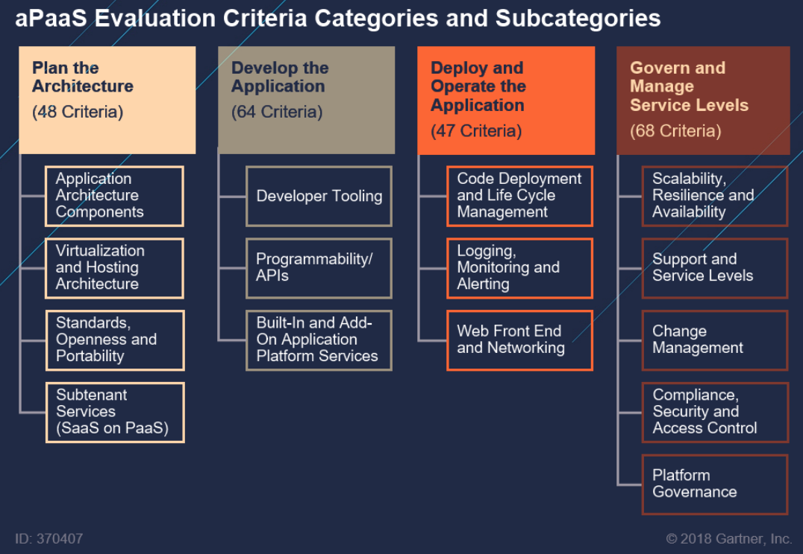

# ☁️ Cloud Computing

### 클라우드 컴퓨팅

클라우드 컴퓨팅이란? 서로 다른 물리적인 위치에 존재하는 컴퓨터들의 리소스(컴퓨팅, 네트워크, 스토리지 인프라 자원, 서비스, 플랫폼, 애플리케이션)를 가상화 기술로 통합해 사용자에게 제공하는 기술. 개인용 컴퓨터나 기업의 서버에 개별적으로 저장해두었던 프로그램이나 문서를 클라우드에 저장하고, 웹 브라우저 등 필요한 어플리케이션을 구동해 원하는 작업을 수행할 수 있는 사용자 중심의 컴퓨터 환경.

클라우드 컴퓨팅에서 얼마만큼 사용자가 관리하고 얼마만큼 클라우드에서 제공받는가에 따라 4가지로 나눠져 있다.

#### 장점

-   경제성 - 사용하고자 하는 기간을 사용하고자 하는 기간만 서비스로 사용 가능. 소프트웨어와 데이터를 클라우드에서 통합 관리해 소프트웨어 업데이트 작업 및 데이터 유지보수의 효율성을 높이고 비용을 절약할 수 있다.
-   유연성 - 필요한 만큼 확장하고, 필요하지 않을 때는 축소하는 등의 유연한 활용이 가능하다.
-   가용성 - 클라우드 데이터 센터 안의 일부 하드웨어에 문제가 발생해도 서비스를 계속해서 사용할 수 있다.
-   빠른 구축 속도 - 자체 시스템을 구축할 경우 시간이 오래걸리지만 클라우드를 이용하면 신속하게 시스템을 구축할 수 있다.

### 클라우드 컴퓨팅의 종류

#### 0.On-Premises (Packaged Software)

직접 인프라와 플랫폼, 어플리케이션까지 모두 구성하여 관리하는 모델.

[단점]

물리적인 장치, 하드웨어 (CPU, RAM, Storage, Network device 등등)을 모두 직접 구매해야 한다. OS도 직접 설치하고, 네트워크 환경도 구성하고, 서버 관리(트래픽, 프로지버닝)도 직접 해야하기에 매우 큰 시간과 돈을 소비해야 한다.

#### 1.IaaS (Infrastructure as a service): host

Infrastructure 레벨(Networking, Storage, Servers, Virtualization)을 제공하는 서비스를 의미한다. CPU나 하드웨어 등의 컴퓨팅 리소스를 네트워크를 통해 서비스로 제공하는 것. 사용자는 OS와 그 상위 계층만 구성하면 되는 모델.

스토리지, 호스팅, 컴퓨팅, 네트워킹...

일반적으로 적은 OS가 지원됨. AWS 경우 일부 Linux와 Windows Server 제공.

고객은 OS와 어플리케이션을 직접 관리해야 함. 가상 서버에서 OS에 설치되는 데이터베이스와 미들웨어, 응용 프로그램 등의 소프트웨어를 자유롭게 운영할 수 있지만 고객이 스스로 설치하고 관리해야 함. 사용량에 따른 종량제 혹은 월 정액제를 통해 요금을 낸다.

우리가 자주 사용하는 가상 호스팅과 비슷하나, 가상 호스팅은 직접 장비를 사서 그 장비 한에서 자원을 할당하고 구성해야 하는 것과는 달리 IaaS는 기업이 준비해놓는 환경에서 우리가 선택할 수 있다는 점에서 차이가 있다.

[장점]

고객은 가상 서버 하위의 레벨에 대해서는 고려할 필요가 없다.

[단점]

역설적으로 가상 서버 하위의 레벨에 대해서는 고객이 전혀 접근하거나 컨트롤할 수 없다. 가상 서버 하위의 레벨에 대해서 고려할 필요가 없는 사용자가 쓰기에 적합하다.

[예시]

AWS의 EC2: 물리적인 서버와 네트워크, Storage 등등을 직접 구매하거나 준비하지 않아도 원하는 OS를 깔아 서버로 사용할 수 있다. 사용자가 원하는 OS를 고르고 해당하는 스펙을 고르기만 하면 모든 관리를 해줌. 선택권을 주고, OS의 종류나 다양한 자원들을 사용자가 선택하므로 대표적인 Iaas라고 불리고 있다.

#### 2.PaaS (Platform as a service): build

IaaS에 추상화 레이어를 하나 더한 것.

개발자가 응용 프로그램을 작성할 수 있도록 플랫폼 및 환경을 제공하는 모델. IaaS는 물론 개발 툴과 기능, 애플리케이션 배포 등을 안전하게 제공하는 것. 미들웨어, DB관리, 애널리틱스, 운영체제 등이 포함된다.

운영 팀이 인프라를 모니터링 할 필요가 없다. 하드웨어와 OS, 미들웨어까지 구축되어있는 플랫폼을 서비스로 이용하는 것. OS, Server 하드웨어, Network 등등을 고려할 필요가 없고, 어플리케이션 자체에만 집중할 수 있다. 단기간에 응용프로그램을 개발하여 서비스를 제공할 수 있다.

앞서 본 AWS EC2 같은 IaaS가 VM을 제공한다면, PaaS는 node.js나 Java와 같은 런타임을 깔아놓고, 거기에 소스코드를 넣어서 돌리는 구조. (완성된 소스를 올리기만 하면 됨)

개발자는 소스코드만 적어서 빌드하고, 컴파일은 클라우드에서 해서 결과만 가져오는 것.

[장점]

PaaS는 이미 설치된 미들웨어 위에 코드만 돌리면 되서 관리가 매우 편하다. 가장 이상적인 어플리케이션 플랫폼 관점의 클라우드 모델로 받아들여지고 있다.

[단점]

하나의 인프라를 기반으로 개발할 수 있다는 것 자체가 장점이자 단점. IaaS에 비해 비용이 더 비싸다. IaaS에서 했던 복잡한 설치 및 환경설정이 필요없다.

[예시]

-   AWS Elastic Beanstalk
-   Heroku
-   Google App Engine
-   IBM Bluemix
-   Naver Cloud Platform

#### 3.Saas (Software as a service): consume

On demand software. 설치할 필요도 없이, 클라우드를 통해 제공되는 SW이다. 하드웨어와 OS, 미들웨어, 애플리케이션까지 구축되어 있는 소프트웨어를 서비스로 이용하는 것. 소프트웨어를 자체 컴퓨터에 저장하지 않고 원격의 호스트에 접속해 원할 때마다 ‘서비스’로 이용하는 것.

모든 것을 기업(클라우드)에서 제공하므로, 사용자는 별도의 설치 없이 SW를 사용할 수 있다. SaaS는 소비 관점에서 제공되는 IT 방식의 서비스이다. 구독이나 트래픽 기반으로 돈을 벌 수 있다.

[장점]

클라우드에 있는 SW를 웹 브라우저로 불러와 언제 어디서나 사용할 수 있다. 사용자는 웹만 접속하면 되기에 사용하기 쉽고, 업데이트를 빠르게 제공 받을 수 있다. 기업 입장에서도 클라우드에 SW가 있기에 따로 업데이트를 하지 않아도 된다.

[단점]

반드시 인터넷에 접속해야지만 사용할 수 있다. 데이터 노출에 대한 위험이 있다.

[예시]

메일, 구글 클라우드, 네이버 클라우드, MS오피스365, 드롭박스, Youtube 등

#### 4.Serverless

서버리스 + 클라우드 서비스 종류 한글 설명: https://velopert.com/3543

컴퓨터/가상머신에 서버를 설정하고 이를 통해 처리하는 것 BaaS (Backend as a service), Faas (Function as a service) 를 사용하는 것.

#### +) aPaaS (Application Platform as a Service)

PaaS는 IaaS에서 더 up-stack 기능들을 쌓아올리면서 발전한 것이고, aPaaS는 SaaS에서 더 down-stack 기능들을 제공하면서 발전한 것이다.

PaaS는 Infrastructure + focused software development service

aPaaS 는 Application + focused software development service

Apaas는 applications from cloud의 development, deployment 환경을 제공한다.

**aPaaS provides app development projects with underlying infrastructure and a software layer for the actual development and design.**

Reusable components, visual IDEs, abstraction and automation streamline application development, provisioning and deployment.

[예시] Outservice, mendix.

[aPaaS vs PaaS?](https://www.mendix.com/understanding-application-platform-as-a-service/#)

[PaaS or Platform as a Service](https://mendixrebrand.wpengine.com/which-is-the-right-platform-as-a-service-paas-for-you/), refers to any cloud-based middleware, including BPM, messaging apps and other tools. aPaaS or Application Platform as a Service refers specifically to PaaS platforms specialized in cloud-based application development.

https://www.ceart.kr/webcontent/ckeditor/2019/9/27/c110ce28-48ea-49b0-97ca-8035653ed9f1.pdf

### 클라우드 네이티브

일반적인 의미: 일반적인 의미에서 “클라우드 네이티브”는 클라우드 컴퓨팅 제공 모델의 이점을 활용하는 애플리케이션 구축 및 실행 접근 방법이다.

CNCF가 정의하는 좁은 의미: 컨테이너화되는 오픈소스 소프트웨어 스택을 사용하는 것을 의미. 애플리케이션의 각 부분은 자체 컨테이너에 패키징되고 동적 오케스트레이션을 통해 각 부분이 적극적으로 스케줄링 및 관리되어 리소스 사용률을 최적화함. 마이크로서비스 지향성을 통해 애플리케이션의 적극적인 민첩성과 유지 관리 편의성을 높인다.

클라우드 네이티브 앱 개발에는 일반적으로 데브옵스, 애자일 방법론, 마이크로서비스, 클라우드 플랫폼, 쿠버네티스 및 도커와 같은 컨테이너, 그리고 지속적 제공이 포함된다. 간단히 말해 새롭고 현대적인 모든 애플리케이션 배포 방법이 사용된다.
