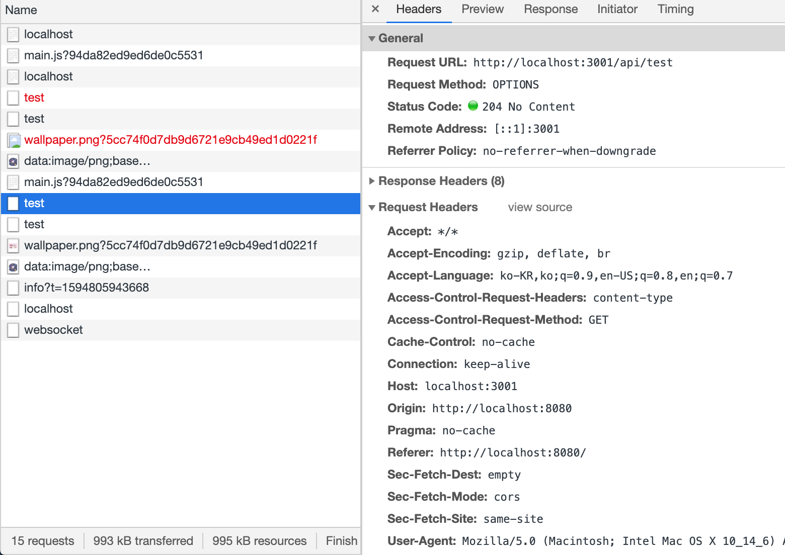
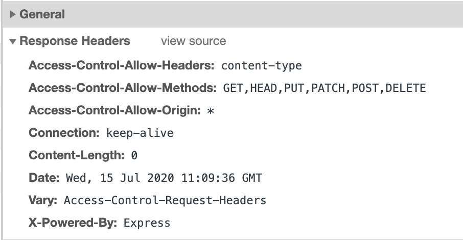
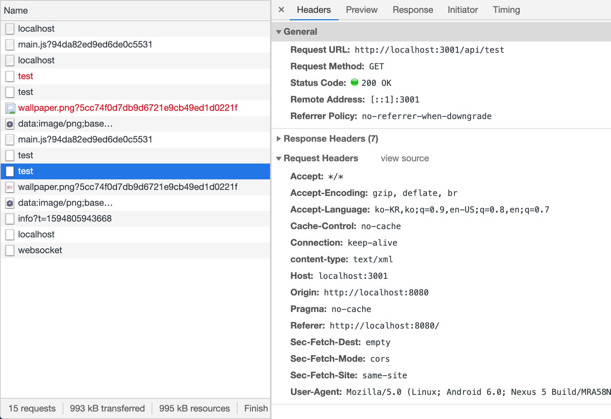

# CORS(Cross Origin Resource Sharing)란?

[MDN 문서](https://developer.mozilla.org/ko/docs/Web/HTTP/Access_control_CORS이란)

[자료 출처](https://evan-moon.github.io/2020/05/21/about-cors/)

## 1. 관련 개념

### 1) Origin

URL은 아래와 같이 여러개의 구성 요소로 이루어져 있다.

Origin은 그 중 **Protocol, Host, 그리고 Port** 를 합친 것을 의미한다. 즉, 서버의 위치를 찾아가기 위해 필요한 가장 기본적인 것들을 합쳐놓은 것이 바로 Origin이다.

⚠️ 주의) Origin을 비교하는 로직은 **브라우저에 구현**되어 있는 스펙이다. 브라우저가 CORS 정책 위반인 응답을 버리는 식으로 이뤄지므로 서버 간 통신에서는 CORS 이슈가 발생하지 않는다.


참고로 브라우저 콘솔에서 `location.origin` 으로 Origin을 확인할 수 있다.

### 2) SOP (same origin policy)

같은 Origin에서만 리소스를 공유할 수 있다는 규칙을 가진 정책이다.

그러나, **CORS 정책을 지킨 리소스 요청**에 대해서는 다른 Origin이더라도 **예외적으로 허용**된다.

## 2. CORS의 동작 원리

기본적인 흐름은 아래와 같다.

### 1) 클라이언트의 요청

웹 클라이언트가 다른 Origin의 리소스를 요청할 때는 HTTP를 사용해 요청을 보낸다. 이때, 클라이언트는 **요청 헤더의 `Origin`  필드에 요청을 보내는 출처를 함께 담아**보낸다.

### 2) 서버의 응답

서버는 이 요청에 대한 응답을 할 때, **응답 헤더의 `Access-Control-Allow-Origin` 필드에 이 리소스를 접근하는 것이 허용된 출처를 담아**보낸다.

### 3) 응답을 받은 클라이언트

응답을 받은 브라우저는 자신이 보낸 요청의 `Origin` 과 서버가 보내준 응답의  `Access-Control-Allow-Origin` 을 비교한 후, 이 응답이 유효한지 아닌지를 결정한다.

## 3. CORS의 3가지 시나리오

실제로 CORS는 아래 3가지 시나리오에 따라 변경된다.

### 1) Preflight Request

Preflight 방식은 일반적으로 웹 어플리케이션을 개발할 때 가장 흔한 시나리오로, 브라우저가 요청을 한번에 보내지 않고, **예비 요청과 본 요청으로 나누어**서 보내는 경우이다.

이때, 본 요청을 보내기 전 보내는 예비 요청을 `Preflight` 라고 부르는 것이다.

이 Preflight에는 OPTIONS HTTP 메소드가 사용되며, Preflight의 목적은 브라우저가 본 요청을 보내기 전, 이 요청을 보내는 것이 안전한지 확인하기 위함이다. (요청의 유효성 검사)


Preflight을 받은 서버는 이에 대한 응답으로 현재 서버가 어떤 것들을 허용하고, 어떤 것들을 금지하고 있는지에 대한 정보(허용 정책)를 응답 헤더에 담아서 브라우저에 보내준다.

브라우저는 Preflight과 서버가 응답에 담아 보내준 허용 정책을 비교한 후, 해당 요청이 유효하다고 판단되면 같은 end point로 본 요청을 보낸다. 

이후 서버가 본 요청에 대한 응답을 하면 브라우저는 최종적으로 응답 데이터를 JS에게 넘겨준다.

[브라우저에서 직접 실험해보자! 🙃]

> http://localhost:8080/ 에서 3001번 포트에 떠있는 서버로 fetch 보내기

```js
// 이거 생략하면 Options request가 보이지 않더라. 왜인지 모르겠다.
const headers = new Headers({
    "Content-Type": "text/xml",
});

export default {
    async list() {
        const response = await fetch("http://localhost:3001/api/test", {
            headers,
        });
        const data = response.json();
        return data;
    },
};

```

- 클라이언트가 보내는 Preflight



Origin에 대한 정보 뿐만 아니라, 본 요청에 대한 다른 정보들도 포함되어 있다.  `Access-Control-Request-Headers` 를 사용해 본 요총에서 사용할 `content-type` 알려주거나, `Access-Control-Request-Method`를 사용해 이후 `GET` 메소드를 사용할 것을 서버에게 미리 알려주고 있는 것. 

- Preflight에 대한 서버의 응답



서버가 보내준 응답 헤더의 `Access-Control-Allow-Origin ` 이 중요하다! 나는 모든 Origin을 접근가능하도록 해서 `*` 라고 되어있지만, 여기 특정 URL이 적혀있다면 해당 Origin을 제외한 다른 Origin은 CORS 정책 위반으로 판단된다. 

- 클라이언트의 본 요청




### 2) Simple Request

Simple Request는 **예비 요청 없이** 본 요청부터 보낸 후, 서버가 응답 헤더에 `Access-Control-Allow-Origin` 값을 보내주면 그때 브라우저가 CORS 정책 위반 여부를 검사하는 방식이다. 쉽게 말해 preflight 방식과 동일하나, 예비 요청이 없는 형태이다.


하지만 Simple Request는 꽤 까다로운 조건을 만족하는 경우에만 가능하다. 조건은 아래와 같다.

1. 요청의 메소드는 `GET`, `HEAD`, `POST` 중 하나여야 한다.
2. `Accept`, `Accept-Language`, `Content-Language`, `Content-Type`, `DPR`, `Downlink`, `Save-Data`, `Viewport-Width`, `Width`를 제외한 헤더를 사용하면 안된다.
3. 만약 `Content-Type`를 사용하는 경우에는 `application/x-www-form-urlencoded`, `multipart/form-data`, `text/plain`만 허용된다.

2번 조건의 헤더들은 아주 기본적인 헤더들이기에, 추가적인 헤더를 사용하지 않는 경우가 드물다. (ex. 사용자 인증을 위한 `Authorization`  헤더) 나아가, 대부분의 HTTP API는 `text/xm1` 이나 `application/json` 컨텐츠 타입을 가지도록 설계되기에 사실상 Simple Request가 가능한 상황은 드물다고 할 수 있다.


### 3) Credentialed Request

Credentialed Request는 인증된 요청을 사용하는 방법으로, 좀 더 보안을 강화하고 싶을 때 사용하는 방법이다.

브라우저가 제공하는 비동기 리소스 요청 API인 `XMLHttpRequest` 객체나 `fetch` API는 별도의 옵션 없이는 브라우저의 쿠키 정보나 인증과 관련된 헤더를 요청에 담지 않는다. 요청에 인증과 관련된 정보를 담을 수 있게 해주는 옵션이 바로 **credentials 옵션**이다.

credentials 옵션엔 아래 3가지 값을 사용할 수 있다.

| 옵션 값              | 설명                                           |
| :------------------- | :--------------------------------------------- |
| same-origin (기본값) | 같은 출처 간 요청에만 인증 정보를 담을 수 있다 |
| include              | 모든 요청에 인증 정보를 담을 수 있다           |
| omit                 | 모든 요청에 인증 정보를 담지 않는다            |

만약 다른 Origin으로 Ajax 요청을 보낼 때 credentials 옵션으로 `same-origin`이나 `include` 를 사용해 리소스 요청에 인증 정보가 포함된다면, 브라우저는 단순히 `Access-Control-Allow-Origin`만 확인하는 것이 아니라 좀 더 빡빡한 검사 조건을 추가하게 된다.

1. `Access-Control-Allow-Origin`에는 `*`를 사용할 수 없으며, 명시적인 URL이어야 한다.

2. 응답 헤더에는 반드시 `Allow-Control-Allow-Credentials: true`가 존재해야 한다.


## 4. CORS를 해결할 수 있는 방법

### 1) 서버의 응답 헤더에 `Access-Control-Allow-Origin` 세팅하기

와일드카드인 `*` 를 사용해 모든 출처에서 오는 요청을 받겠다는 임시방편을 사용할 수도 있겠지만, 이는 보안적으로 심각한 이슈를 발생시킬 수도 있다.

가급적이면  `Access-Control-Allow-Origin: https://hanameee.github.io`와 같이 출처를 명시해주는 것이 좋겠다.

헤더는 서버 엔진의 설정에서 직접 추가할 수도 있지만, 응답 미들웨어 등을 사용하여 세팅하는 것이 편리하다. Node.js 같은 경우엔 Express에서 CORS 관련 설정을 위한 미들웨어 라이브러리를 제공하고 있다.

### 2) Webpack Dev Server로 리버스 프록싱하기

CORS를 가장 많이 마주치는 환경이 바로 로컬의 프론트엔드 개발 서버에서 요청을 보낼 때이다. 백엔드에  `Access-Control-Allow-Origin` 헤더가 세팅되어 있더라도, 개발을 할 때는 개발서버인 localhost에서 요청을 보내기 때문이다.

프론트엔드 개발 시 대부분 webpack과 `webpack-dev-server` 을 활용하여 자신의 머신에 개발 환경을 구축하는데, 이 라이브러리가 제공하는 프록시 기능을 사용하면 편하게 CORS 정책을 우회할 수 있다. (참고로 CRA에도 이 proxy 기능이 있다.)

```js
module.exports = {
  devServer: {
    proxy: {
      '/api': {
        target: 'https://api.evan.com',
        changeOrigin: true,
        pathRewrite: { '^/api': '' },
      },
    }
  }
}
```

위처럼 설정을 해놓으면, target으로 웹팩이 요청을 프록싱해주기 때문에 CORS 정책을 우회할 수 있다.

다만 이 방법은, 실제 프로덕션 환경에서도 API 서버의 Origin과 클라이언트 어플리케이션의 소스를 서빙하는 Origin이 같은 경우에 사용하는 것이 좋다. 어플리케이션을 빌드하고 나면 더이상 개발환경(webpack-dev-server)이 구동하는 환경이 아니기 때문에, 프록싱이 작동하지 않고, 따라서 엉뚱한 곳으로 API를 보낼 위험이 있기 때문이다.

## References

[CORS는 왜 이렇게 우리를 힘들게 하는걸까?](https://evan-moon.github.io/2020/05/21/about-cors/)

[Cross Origin Resource Sharing - CORS](https://homoefficio.github.io/2015/07/21/Cross-Origin-Resource-Sharing/)

[fetch와 Cross-Origin 요청](https://ko.javascript.info/fetch-crossorigin)