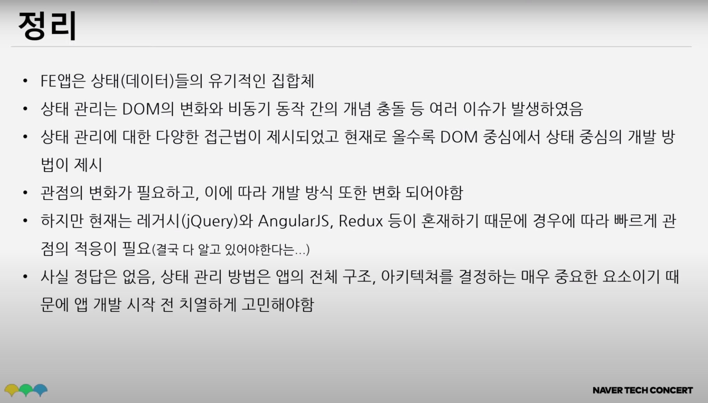
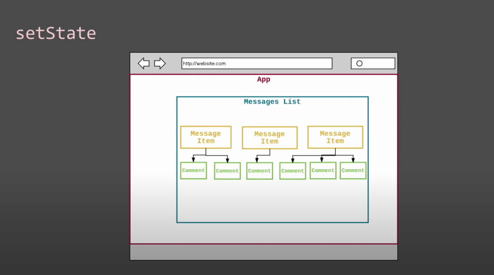

# SPA

## SPA란?

Single Page Application: 전체 페이지를 서버에서 받아 새롭게 로드하는 대신, 비동기적으로 (AJAX) 필요한 데이터를 요청하여 페이지의 일부분을 업데이트 하는 웹 애플리케이션이다. SPA 구현에 대표적으로 사용되는 프레임워크 (or 라이브러리)에는 React, Vue, Angular 등이 있다. 

## SPA 프레임워크 3대장

왜 사람들은 React, Vue, Angular 등을 가지고 SPA를 구현할까?

웹 애플리케이션의 상태 변화로 인한 DOM을 조작 비용은 비싸다. 여기서 "비싸다" 의 의미는 DOM 조작이 야기하는 브라우저 렌더링 과정의 리렌더링과 리페인팅이 많은 연산을 요한다는 것이다.

SPA 프레임워크/라이브러리는 SPA 앱을 유지보수하기 쉬운 형태로 도와줄 뿐만 아니라, 사용자와의 상호작용으로 인해 DOM 조작이 빈번한 SPA에서 DOM 조작 비용을 줄여준다. 일례로, 리액트는 DOM을 수정했을 때 실제 DOM을 변경하는 것이 아니라 실제 DOM과 비교연산하여 실제로 변경된 내용들을 일괄 처리해 리렌더링/리페인팅을 최소화한다.

### React

Virtual dom을 사용해 최적으로 UI를 렌더링하는 메커니즘을 제공한다.

#### Virtual dom이란?

실제 DOM을 생성할 때 필요한 정보들을 담은 객체이다.

#### React의 작동 원리

리액트는 업데이트 할 내용이 생기면, 실제 DOM을 조작하는 것이 아니라 virtual DOM의 객체 프로퍼티만 변경한다. virtual DOM 내부의 프로퍼티만 수정한 뒤, 모든 노드에 걸친 업데이트가 끝나면 그때 단 한번 real DOM으로의 렌더링을 시도한다. 이런 방식으로 비용이 비싼 DOM 조작에 따른 오버헤드를 최대한 줄일 수 있다.

setState는 비동기로 수행되며 (setState의 호출은 상태 변경을 **예약**하는 것), 여러번의 setState는 순서대로 큐에 담겨 reconcilication 과정을 거친 후 렌더링된다. 이렇게 잦은 상태변화를 하나로 처리하여 성능을 높일 수 있다.

#### React의 알고리즘

React는 virtual DOM과 DOM을 비교해 달라진 부분만 업데이트한다. 그렇다면, "달라진 부분"을 리액트는 어떻게 효과적으로 찾아낼까?

전체 DOM 트리를 탐색하고 비교하는 일반적인 알고리즘(diff 알고리즘)은 O(n^3)의 복잡도를 갖는다. 리액트는 DOM트리를 BFS와 유사하게 level-by-level로 비교하되, 다음 가정에 기반의 O(n)의 휴리스틱 diff 알고리즘을 구현했다.

1. 서로 다른 타입의 두 엘리먼트는 서로 다른 트리를 만들어낸다 = 부모 노드의 타입이 다르면 자식 노드는 비교하지 않는다.
2. 개발자가 key prop을 통해 여러 렌더링 사이에서 어떤 자식 엘리먼트가 변경되지 않아야 할 지 표시해 줄 수 있다 = 노드에 key를 부여하면 일일히 탐색하지 않고도 자식 노드에 접근할 수 있다.

#### React가 항상 좋다?

무조건 React, Virtual DOM이 빠른 것이 아니다. 충분히 빠를 뿐. 정보 제공만 하는 정적인 웹을 구축한다면 오히려 일반 DOM이 성능이 더 좋다.

DOM 조작이 많이 발생하는 SPA의 경우 리액트를 사용해 브라우저의 연산 양을 줄여 성능을 개선하는 것이 좋다.

[참고 자료]

[2018 DevFest - 실전 SPA 상태관리톺아보기](https://drive.google.com/file/d/1f4UHB-jvN5w_qtdIhhUArjsK3jwnVbAY/view)

[Do I really need a SPA framework?](https://dev.to/itnext/do-i-really-need-a-spa-framework-3occ)

[Reconciliation: React의 렌더링 알고리즘](https://www.huskyhoochu.com/virtual-dom/)

[리액트 공식 문서 - 재조정 (Reconciliation)](https://ko.reactjs.org/docs/reconciliation.html#gatsby-focus-wrapper)

https://velopert.com/3236

----

## 디자인패턴

### flux

애플리케이션에서 데이터를 취급하기 위한 패턴. Redux는 flux를 기반으로 한다.

[출처](https://beomy.tistory.com/44)

['데이터가 폭포수처럼 흘러내려' React의 flux 패턴](https://www.huskyhoochu.com/flux-architecture/)

[Flux로의 카툰 안내서](https://bestalign.github.io/2015/10/06/cartoon-guide-to-flux/)


Flux의 구조: Flux는 크게 Action, Dispatcher, Store, View 이루어진다.

- Action: 액션은 state를 변경할 수 있는 명령어와도 같다. Dispatcher에서 콜백함수를 이용해 Store에 데이터를 전달할 때, 이 콜백 함수 실행 시 인수로 전달되는 데이터가 담겨 있는 객체가 바로 Action이다. 대체로 이 Action은 액션 생성자에서 만들어지며, 액션 생성자는 새로 발생한 액션의 타입과 데이터 페이로드를 액션 메시지로 묶어 dispatcher로 전달한다.
  액션 생성자를 사용하면 좋은 점은, 액션 생성자 파일 그 자체가 앱에서 사용되는 API 전체 (모든 가능한 상태변경) 를 나타내주기 때문이다.
- Dispatcher: 기본적으로 **콜백**이 등록되어 있는 곳이다. Dispatcher은 액션을 보낼 필요가 있는 모든 **스토어**를 가지고 있고, 액션 생성자로부터 액션이 넘어오면 콜백함수를 이용해 여러 스토어에 액션을 보낸다. Action이 발생하면 이는 Dispatcher로 전달되고, Dispatcher는 이 액션을 스토어들에 전달한다. 구독과는 조금 다른데, Dispatcher은 액션 타입과는 무관하게 모든 스토어로 액션을 보내고, 액션을 받은 스토어에서 이를 처리할지 말지를 결정한다. 
- Store: Store는 앱 내의 모든 상태(state)와, state와 관련된 모든 로직(메서드)를 가지고 있다. 스토어를 직접 변경하는 것은 불가능하며 반드시 액션 생성자 - dispatcher을 거쳐 액션을 보내야만 한다.
  먄약 스토어가 dispatcher에 등록되어 있다면 (Store은 Dispatcher로부터 메세지를 수신 받기 위해 Dispatcher에 콜백 함수를 등록한다) 모든 액션을 받게 되고, 일반적으로 switch문을 사용해서 처리할 액션을 결정하게 된다. 어떤 타입의 액션이 날아왔느냐에 따라 메서드를 다르게 적용해 상태를 변경하고, Store이 변경되면 변경 이벤트를 내보낸다. 이 이벤트는 컨트롤러 뷰(controller view)에게 변경된 상태를 알려준다.
- View: 뷰는 상태를 가져와 유저에게 보여주고, 입력받을 화면을 렌더링하는 역할을 맡는다. React가 뷰에 해당한다고 볼 수 있다. 컨트롤러 뷰는 스토어와 뷰 사이의 중간관리자같은 역할을 하며, 스토어로부터 변경된 상태를 받아 모든 자식 뷰에게 새로운 상태를 넘겨준다. 데이터를 넘겨받은 뷰는 화면을 새로 렌더링한다.

Flux의 동작 원리: 

1) 초기화

- Store은 Dispatcher에 액션이 들어오면 알려달라고 말해둔다. (= Dispatcher에 콜백 함수를 등록해둔다.)
- 컨트롤러 뷰는 스토어에게 최신 상태를 묻는다. 
- 스토어가 컨트롤러 뷰에게 상태를 주면, 컨트롤러 뷰는 렌더링 하기 위해 모든 자식 뷰에게 상태를 넘겨준다.
- 컨트롤러 뷰는 스토어에게 상태가 바뀔 때 알려달라고 말해둔다. 

2) 데이터 흐름 (사용자 입력으로부터 이벤트가 발생했을 경우)

- 뷰는 액션 생성자에게 액션을 준비하라고 말한다.
- 액션 생성자는 액션을 만들어서 디스패쳐에 넘겨준다.
- 디스패쳐는 들어온 액션의 순서에 따라 (동기적으로) 알맞은 스토어로 보낸다. 각 스토어는 모든 액션을 받지만 필요한 액션만을 골라서 상태를 필요에 맞게 변경한다.
- 상태 변경이 완료되면 스토어는 자신을 구독하고 있는 컨트롤러 뷰에게 그 사실을 알린다.
- 연락을 받은 컨트롤러 뷰들은 스토어에게 변경된 상태를 요청한다.
- 스토어가 새로운 상태를 넘겨주면 컨트롤러 뷰는 자식 뷰들에게 새로운 상태에 맞게 렌더링하라고 알린다.

----

## 상태관리

상태관리 프레임워크가 필요한 이유? 상태는 각각의 뷰에서, 때로는 뷰와 상관없이 필요에 의해서, 실시간, 비동기로 계속해서 변화한다. 결국 상태가 언제, 어떻게, 왜 변화했는지 제어할 수 없는 상황에 이르게 된다.

### 상태관리 패러다임의 변화

Jquery > AngularJS > Redux

### jQuery

jQuery는 DOM을 베이스로, DOM에 jQuery로 동작을 입히는 것.

변경이 필요한 대상 DOM 요소를 먼저 선택하고, 이후 필요한 작업을 수행하는 형태.

각 Element에 상태를 저장하기에 서로 다른 Element의 상태변화 추적이 어려움.

### AngularJS

AngularJS는 출력할 데이터에 초점을 맞추어 작업이 수행되며, 데이터의 값이 변경되면 출력도 자동적으로 수행되도록 처리됨.

### Redux

Flux 패턴을 기반으로 한 단방향 상태관리 아키텍처.

관리하는 상태가 많은, 복잡한 어플리케이션에서 Redux를 사용하면 상태를 언제, 왜, 어떻게 바꾸었는지 알 수 있기 때문에 좋다.



미래 - Apollo+Graphql (Graphql 서버 + Apollo 클라이언트)

### 상태관리 라이브러리를 사용하는 이유

컴포넌트 내부에서 상태를 관리하는건 쉽다 이거야. 그런데 컴포넌트에 자식이 주렁주렁 달리기 시작하면? 손자 컴포넌트에서 증조 할아버지 컴포넌트의 상태를 바꾸려고 한다고 가정하면 머리 아파지기 시작한다.

이를 해결하기 위해서 나온 것이 Context API.

참고) Vue와 Angular에서 Redux를 잘 안쓰는 이유는 리액트와는 달리 자기들만의 상태관리 방법이 있기 때문.

#### Context API가 있는데 왜 궂이 상태관리 라이브러리를 사용해야 할까?

React는 Context API를 가지고 있지. 그럼 Context API가 있는데 Redux나 MobX등의 상태관리 라이브러리가 필요한 이유는 무엇일까?

물론 Context API는 물론 Redux를 대체할 수 있다. Context API - Redux 는 Javascript - jQuery 와 같은 관계이기 때문이다. js로 jQuery를 만들었듯이, React-redux 랑 MobX-react는 모두 context API로 만들었기 때문에 당연히 대체가 가능하다. Context API에 편의기능을 붙인 것이라고 생각해도 됨.

하지만 우리가 왜 js 안쓰고 jQuery를 썼던가? (지금은 안쓸지라도) 편하니까! Redux, MobX도 마찬가지다. 기능들이 다 만들어져 있고, 편하기 때문에!

만약 Context API랑 useReducer hook을 사용해서 자체적으로 사용을 하다보면 종국에는 redux(같은 것)를 구현하고 있는 자신을 발견하게 될 것....😂 그럴 바에 그냥 Redux, MobX 쓰자...그런 말이지.

### Redux 

[참고 자료](https://www.huskyhoochu.com/flux-architecture/)

Flux에서 나온 개념이지만, Flux 패턴을 그대로 구현할 것이 아니다. 아래와 같은 다른 점이 있다.

1. 리덕스에는 dispatcher이 없다. Redux에는 Flux와는 달리 dispatcher 개념이 없고, 리듀서가 dispatcher + store의 기능을 담당한다. 리듀서는 각 액션 타입에 대한 메서드를 순수 함수로 구현한다.
2. 리덕스의 스토어는 싱글톤 패턴을 따른다. 리덕스에서는 모든 종류의 리듀서가 단 하나의 스토어에 묶인다. 각 뷰가 자신이 필요한 스토어만 각각 접근할 수 있었던 flux와 달리, Redux는 무조건 싱글 스토어를 통해 각 리듀서에 접근할 수 있다.

단방향: 아예 State를 하나에 몰아넣고 Redux에서 이 하나의 State를 관리하는 것임. Redux를 사용하면 useState를 아예 안 쓸수도 있다. 반드시 안 써야 하는 것은 아님.

리덕스를 왜 쓰냐? 컴포넌트 깊이가 깊어졌을 때, 컴포넌트 사이의 state를 넘나드는 것이 힘들기 때문에. 어떤 state가 한 컴포넌트 내부에만 종속되어 있다면, state를 써도 상관 없다. 단일 컴포넌트 내에서 만 관리되는 state는 state를 쓰고, 여러 컴포넌트와 관련된 state는 redux에서 관리하는 것이 편리하다.

Single store - 하나의 거대한 immutable state를 가진다.

### MobX

양방향: 뷰를 바꿔도 데이터가 바뀌고, 데이터가 바뀌어도 뷰가 바뀌는 것이 양방향 모델링. 편하기는 엄청 편하다. 단점이라면 프로그램이 복잡해지다보면 서로가 서로를 바꾸게 되어 버그가 많이 생긴다. 페이스북이 양방향의 문제를 해결하기 위해 개발한 것이 Flux라는 단방향 상태관리 패턴.

개념적으로 MobX는 Spreadsheet에 비유될 수 있다.

state = observable value

mobx는 데이터를 observable로 감싼다. 이걸 Spreadsheet의 data cell로 볼 수 있따.

derivations

- computed - observable data로부터 state를 얻는(생성하는) pure function: spreadsheet의 함수식같은 것. 엑셀에서 C셀이 셀 A+B인 값이라면 C는 computed 인 것임.
- Reactions -  observable data로부터 값을 얻는게 아니라 side effect를 생성한다. 예를 들면, 엑셀에서 함수식의 값을 가져와서 스크린에 그리는 것.

#### Redux vs. MobX

| Redux                  | MobX                         |
| ---------------------- | ---------------------------- |
| Manually track updates | Automatically tracks updates |
| Explicit               | Implicit                     |
| Passive                | Reactive                     |
| Read-only state        | Read and write to state      |
| Actions required       | Actions not required         |

##### 1. Single store vs. multi store

Redux: Single source of truth. 하나의 Store에 상태가 저장됨.

Mobx: Distributed domain class. 자유롭게 도메인별로 다양한 store을 유지하고, 내부 로직을 캡슐화 할 수 있음.

##### 2. Plain objects vs. Observable data

Redux: 상태가 그냥 하나의 거대한 JS Object임

MobX: 생긴건 JS Object 와 유사하나 Observable이라는 속성을 부여한 data임

```js
let user = observable({
  id: '123',
  name: 'hannah'
})

class User {
  @observable user;
  constructor(user) {
    this.user = user;
  }
}
```

Observable이 작동하는 원리?

MobX는 reference를 observe한다. Tracked function (computed, reactions) 에서 참조된 observable value는 recored되며, 레퍼런스가 변경되면 MobX는 이에 react한다.

##### 3. Immutable vs. Mutable

Redux는 상태가 read-only임. Immutable state + pure reducer functions

MobX는 action으로 명시적으로 바꿀 수도 있지만 view에서 바로 바꿀 수도 있음.

#### 4. Normailzed state vs. Nested state

Redux는 State를 정규화 하는 것이 권장됨. Immutable data를 update하면 state tree에 있는 모든 후손들이 업데이트 된다.

MobX는 정규화 하지 않아도 상관 없음. 어짜피 tracked function과 관련된 애들에만 관심이 있기 때문에.

### 어떤 상태관리를 사용해야 할까

#### 1. setState

시작점은 setState. setState는 결코 안티패턴이 아님.

setState를 통해 리액트의 lifecycle method를 배우고, internal component 상태 관리를 배울 수 있음. 

만약 state가 hierarchical하고 컴포넌트의 구조와 맞는다면 setState만으로도 잘 동작할 수 있다. 예를 들어 아래와 같은 구조인 경우 setState로도 충분하다!



만약 setState로만 힘든 상황이 온다면?

- 컴포넌트들 간에 공유해야 하는 state가 늘어난다 - 즉, internal component state관리 만으로는 부족하면.
-  루트 노드로부터 멀리 떨어져있는 리프 노드에서 상태에 접근해야 하는데, 중간 노드들은 그 상태가 필요 없는 경우. prop을 5단계 이상 내려보내야 한다면.

그때 MobX나 Redux 사용을 고려해볼 수 있다. MobX나 Redux 모두 상태를 **컴포넌트의 외부에서 관리**하기 위한 방법이기 때문.

#### 2. MobX를 사용하면 좋은 경우

보일러플레이트가 적고, more magical 하며, 러닝커브가 낮다.

- 간단한 애플리케이션
- 빠른 프로토타입
- 작은 팀 규모 (유지보수, 확장에 신경을 크게 쓸 필요가 없고 팀 내에서 자체적으로 state를 업데이트 하기 위한 규약을 가지고 있다면)
- 한 도메인 클래스에서 모든 업데이트 로직을 처리할 수 있을 때
- event based 보단, state changes에 react 할 때. Real-time systems, dashboards, text editors, presentation software 등.

#### 3. Redux를 사용하면 좋은 경우

- 복잡한 애플리케이션
- 큰 팀 규모
- 요구사항이 자주 변화할 때
- 한 액션이 여러 개의 state를 변화시킬때
- event based, actions나 events에 react 할 때. Business apps, event based tstems, game events 등등..

[참고 자료]

[TECH CONCERT: FRONT END 2019 - 데이터 상태 관리. 그것을 알려주마](https://www.youtube.com/watch?v=o4meZ7MRd5o)

[Preethi Kasireddy - MobX vs Redux: Comparing the Opposing Paradigms - React Conf 2017](https://www.youtube.com/watch?v=76FRrbY18Bs)