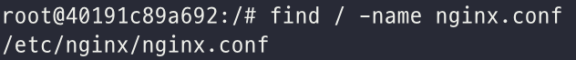
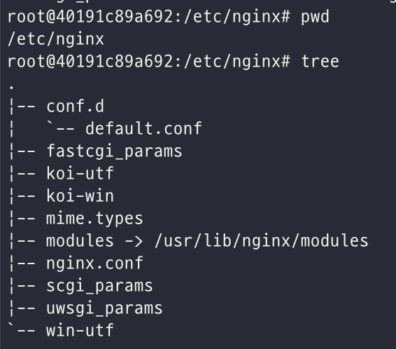

# NGINX

## NGINX란?

NGINX는 어떤 일을 해주는 소프트웨어일까? 공식 문서의 소개를 보자.

> **NGINX** is open source software for web serving, reverse proxying, caching, load balancing, media streaming, and more. It started out as a web server designed for maximum performance and stability. In addition to its HTTP server capabilities, NGINX can also function as a proxy server for email (IMAP, POP3, and SMTP) and a reverse proxy and load balancer for HTTP, TCP, and UDP servers.

출처: https://www.nginx.com/resources/glossary/nginx/

해주는게 아주 많아 보이는 친구다. 차근차근 살펴보도록 하자.

### NGINX의 시작

NGINX 등장 전, 대표적인 웹서버였던 Apache의 C10K Problem을 (10k개 클라이언트의 concurrent connection을 처리) 해결하기 위해 고안한 프로그램이다. 

Event-driven, Asynchronous 아키텍처를 가지고 있고, 기존 웹서버와 비교했을때 혁명적으로 높은 퍼포먼스를 보여주었다.

### NGINX as a Web Server

NGINX는 **빠른 웹서버**를 만들기 위해 처음 고안되었고, 이건 지금도 NGINX 프로젝트의 주 목표다. 웹이 기존의 단순 HTML에서부터 dynamic content를 제공하는 modern web으로 발전함에 따라 NGINX도 발맞춰 발전해왔다. Modern web의 구성요소인 WebSocket, HTTP/2, gRPC 은 물론이고, streaming of multiple video formats (HDS, HLS, RTMP, and others) 역시 제공한다.

### NGINX Beyond Web Serving

NGINX는 비록 웹서버로 시작했지만, 지금은 단지 컨텐츠를 serve하는 것보다 훨씬 많은 web task를 수행할 수 있다.

- High volume of connections를 처리할 수 있기에, NGINX는 reverse proxy나 Load balancer으로 많이 쓰인다.
- client와 second web server 사이에 위치해 SSL/TLS terminator이나 web accelerator로 쓰인다. 특히 성능 향상을 위해 negotiating SSL/TLS, compressing, caching content 등의 역할을 담당한다. NGINX를 content cache와 reverse proxy로 사용해서 application 서버의 부담을 줄이고, 내재하는 하드웨어를 최대한 효과적으로 활용할 수 있다.

출처: https://www.nginx.com/resources/glossary/nginx/

## NGINX의 쓰임새

### 웹서버로서의 역할

HTML, CSS, JS, 이미지와 같은 정적 파일을 HTTP 프로토콜을 통해 웹 브라우저에게 전송하는 역할을 한다. 

### Reverse Proxy로서의 역할

클라이언트와 서버 (reverse server)사이에 위치해, 클라이언트의 HTTP 요청을 받아 (마치 actual endpoint 처럼) 대신 실제 서버로 전달하는 것.


nginx는 **nginx.conf** 파일에서 location 지시어를 통해 요청을 배분한다.

출처:https://whatisthenext.tistory.com/123

## NGINX 구조

### NGINX 설치

- 기본적으로 `apt-get` 을 통해 nginx를 패키지로 설치하면, `/etc/nginx` 폴더에 설치된다.

- 직접 compile 한 경우, `/usr/local/nginx/conf` 또는 `/usr/local/etc/nginx` 에 설치된다.

- ```bash
  sudo find / -name nginx.conf # nginx가 설치된 경로 찾기
  ```

  

### NGINX 구조



|            |                                                           |
| ---------- | --------------------------------------------------------- |
| conf.d     | nginx.conf 에서 불러들일 수 있는 파일을 저장하는 디렉토리 |
| nginx.conf | 접속자 수, 동작 프로세스 수 등 퍼포먼스에 관한 설정들     |

**nginx.conf** 파일은 NGINX가 동작해야 할 방식을 설정 값을 통해 지정하는 파일로, NGINX의 가장 핵심 파일이다.

> nginx.conf

```nginx
user  nginx;
worker_processes  1;

error_log  /var/log/nginx/error.log warn;
pid        /var/run/nginx.pid;


events {
    worker_connections  1024;
}


http {
    include       /etc/nginx/mime.types;
    default_type  application/octet-stream;

    log_format  main  '$remote_addr - $remote_user [$time_local] "$request" '
                      '$status $body_bytes_sent "$http_referer" '
                      '"$http_user_agent" "$http_x_forwarded_for"';

    access_log  /var/log/nginx/access.log  main;

    sendfile        on;
    #tcp_nopush     on;

    keepalive_timeout  65;

    #gzip  on;

    include /etc/nginx/conf.d/*.conf;
}
```

> conf.d/default.conf

```nginx
server {
    listen       80;
    listen  [::]:80;
    server_name  localhost;

    #charset koi8-r;
    #access_log  /var/log/nginx/host.access.log  main;

    location / {
        root   /usr/share/nginx/html;
        index  index.html index.htm;
    }

    #error_page  404              /404.html;

    # redirect server error pages to the static page /50x.html
    #
    error_page   500 502 503 504  /50x.html;
    location = /50x.html {
        root   /usr/share/nginx/html;
    }

    # proxy the PHP scripts to Apache listening on 127.0.0.1:80
    #
    #location ~ \.php$ {
    #    proxy_pass   http://127.0.0.1;
    #}

    # pass the PHP scripts to FastCGI server listening on 127.0.0.1:9000
    #
    #location ~ \.php$ {
    #    root           html;
    #    fastcgi_pass   127.0.0.1:9000;
    #    fastcgi_index  index.php;
    #    fastcgi_param  SCRIPT_FILENAME  /scripts$fastcgi_script_name;
    #    include        fastcgi_params;
    #}

    # deny access to .htaccess files, if Apache's document root
    # concurs with nginx's one
    #
    #location ~ /\.ht {
    #    deny  all;
    #}
}
```

