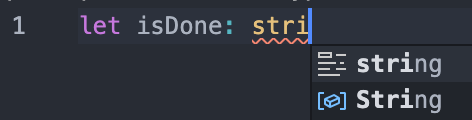
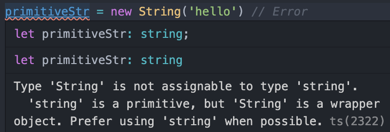

# 1. 기본 타입

타입스크립트는 자바스크립트의 모든 자료형 + enumeration 타입을 지원한다.

| 자료형  | 예시           | 특이사항 |
| ------- | -------------- | -------- |
| Boolean | `let isDone: boolean = false;` | - |
| Number | `let decimal: number = 6;` | [숫자 리터럴](https://developer.mozilla.org/en-US/docs/Web/JavaScript/Reference/Lexical_grammar#numeric_literals)도 해당 |
| String | `let color: string = 'blue'` | 템플릿 리터럴도 해당 |
| Array | `let list: number[] = [1,2,3]` <br /> `let genericList: Array<number> = [1,2,3]` | 제네릭 배열 타입 |
| Tuple | `let x: [string, number]` | 타입과 개수가 고정된 배열 타입. JS에서 없는 인덱스에 접근하면 undefined지만, TS의 튜플 타입에서 없는 인덱스에 접근하면 에러가 발생한다. |
| Enum | `enum Color {Red, Green, Blue}`<br />`let c: Color = Color.Green //1` |  |
| Any | `let notSure: any = 4` | 컴파일러가 타입 검사를 하지 않는다.<br />Object와는 다르다. Object 타입에는 어떤 값이든 할당할 수는 있지만 임의의 메서드를 호출할 수는 없는데, Any 타입은 임의의 메서드를 호출해도 컴파일 에러는 나지 않는다. |
| void | `function clog(): void { console.log("I return nothing")}` | 어떤 타입도 존재할 수 없음을 나타내며, return이 없는 함수의 반환값을 표현하기 위해 사용한다.<br />일반적인 타입 변수에 사용하기엔 undefined만, 그것도 `strict` 모드가 아닐 때만 할당할 수 있기에 유용하지 않다. |
| Null, Undefined | `let u: undefined = undefined`<br />`let n: null = null` | `strict` 모드가 아니라면 모든 타입의 하위 타입. 즉, `null`과 `undefined`는 모든 타입에 할당할 수 있다.<br />`strict` 모드라면 이 타입들은 오직 any와 자기 자신 타입에만 할당할 수 있다. (예외: undefined는 void에 할당 가능)<br />일반적으로는 유니언 타입을 이용해 이 두 타입을 허용하는 식으로 사용한다. |
| Never | `function infiniteLoop(): never {while (true) {}}` | 절대 발생할 수 없는 타입. 무한루프 함수의 반환 타입이나, 항상 오류가 발생하는 함수의 반환 타입. |
| Object | `let obj: object = {}` | 원시 타입이 아닌 타입. |

### 타입은 소문자, 대문자를 구별한다.



문자열에 타입 지정하려고 봤더니, IDE가 2개의 타입을 추천해준다. `string` 과  `String`. 뭐가 맞을까?

이건 Javascript의 자료형과 연결되는 내용이다.

Javascript에는 원시형 자료형에 대응하는 **래퍼 객체**(Object Wrapper)가 있다.

| 원시형  | 래퍼 객체 |
| ------- | --------- |
| number  | Number    |
| string  | String    |
| boolean | Boolean   |
| symbol  | Symbol    |

출처: https://javascript.info/primitives-methods

**TypeScript가 기본으로 제공하는 타입은 모두 소문자**다. 즉, 문자열의 타입은 소문자인 `string`이 맞다.

```typescript
// string: 원시형 문자열 타입
let primitiveStr: string;
primitiveStr = 'hello'; // OK
primitiveStr = new String('hello') // Error
```

마지막 줄처럼, 원시형 문자열 타입에 객체를 할당하면 아래와 같은 에러가 발생한다.



String 생성자 함수로 생성된 String **객체**는 원시형 문자열 타입인 primitiveStr에 할당할 수 없다.

하지만 역으로, 래퍼 객체 타입에는 원시값을 할당할 수 있다.

```typescript
// String: String 생성자 함수로 생성된 String 래퍼 객체 타입
let objectStr: String;
objectStr = new String('hello'); // OK
objectStr = 'hello'; // OK
```

출처: https://poiemaweb.com/typescript-typing

결론: 원시값에 타입을 설정할 땐, **소문자 타입**을 사용하는 것이 권장된다.

### Enum은 어디에 쓸까?

출처: https://medium.com/@seungha_kim_IT/typescript-enum%EC%9D%84-%EC%82%AC%EC%9A%A9%ED%95%98%EB%8A%94-%EC%9D%B4%EC%9C%A0-3b3ccd8e5552

### Object vs object

object 타입은 **원시형이 아닌** 값들을 받을 수 있다. 반면, Object 타입은 자바스크립트에 포함된 모든 생성자들의 프로토타입이기에 Object에는 모든 객체(원시값 포함)가 할당될 수 있다.

- object 타입

```typescript
function foo(bar:object){
  console.log(bar);
}

foo([1,2,3]) // OK
foo({a:1, b:2}) // OK
foo(123) // Error!!
```

- Object 타입

```typescript
function foo(bar:Object){
  console.log(bar);
}

foo([1,2,3]) // OK
foo({a:1, b:2}) // OK
foo(123) // OK
```

### 읽어보면 좋을 링크

- Do's and Don'ts: https://www.typescriptlang.org/docs/handbook/declaration-files/do-s-and-don-ts.html#general-types