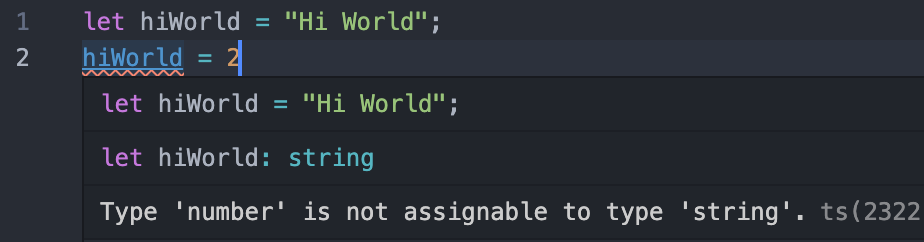

# 4. 리터럴 타입

### 리터럴 타입

리터럴 타입은 보다 더 구체적인 타입이다. String, numbers, boolean 3개의 literal type이 있고 이를 사용해 보다 구체적인 값의 타입을 지정할 수 있다.

### Literal Narrowing

`let` 을 사용할 경우 해당 변수는 다른 값이 할당될 가능성이 있다. 따라서, 타입스크립트는 해당 변수의 타입을 "넓게" 지정한다. 

```typescript
let hiWorld = "Hi World"; // ts는 hiWorld의 타입을 string으로 지정한다.
```

hiWorld에 string이 아닌 값을 넣으면 에러가 나지만, 다른 string을 할당하는 것은 에러를 발생시키지 않는다.



반면, `const` 를 사용할 경우 ts는 해당 변수에 다른 값이 할당될 가능성이 없다고 판단하고 정확히 해당 값으로 타입을 설정한다.

```typescript
const hiWorld = "Hi World"
```

hiWorld의 타입은 string 리터럴인 "Hi World" 이고, 그 외에 어떤 값도 할당할 수 없다. const이기에 같은 값 ("Hi World") 재할당도 안됨.


이렇게 넓은 범위 (string) 타입에서 좁은 범위 타입 (리터럴) 로 타입을 좁히는 것을 narrowing이라고 한다.

### 리터럴 타입 예시들

실제로 리터럴 타입을 사용할 때는 union types, type guards, type aliases랑 많이 쓴다.

#### 문자열 리터럴 타입

```typescript
type ABC = "A" | "B" | "C"

const onlyAcceptABC = (param:ABC):void => {
  console.log(param)
}

onlyAcceptABC("A")
onlyAcceptABC("D") // Argument of type '"D"' is not assignable to parameter of type 'ABC'.
```

마치 enum처럼, 특정 값 외에는 에러를 뿜도록 만들 수 있다.

#### 숫자 리터럴 타입

```typescript
interface MapConfig {
  lng: number;
  lat: number;
  tileSize: 8 | 16 | 32;
}

const setUpMap = (param:MapConfig): void => {
  // 어쩌구 저쩌구
}

// tileSize에는 8, 16, 32만 들어가야 한다.
setupMap({ lng: -73.935242, lat: 40.73061, tileSize: 16 });
```

#### 불리언 리터럴 타입

```typescript
interface ValidationSuccess {
  isValid: true;
  reason: null;
}

interface ValidationFailure {
  isValid: false;
  reason: string;
}

type ValidationResult = ValidationSuccess | ValidationFailure;
```

이렇게 속성값 사이에 상관관계가 있는 경우에 불리언 리터럴 타입을 사용할 수 있다고 한다. 흠터레스팅  :thinking:

예시 출처: https://www.typescriptlang.org/docs/handbook/literal-types.html