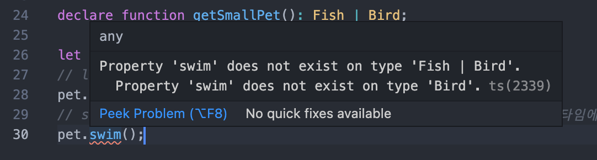

# 5. 유니온과 교차 타입

지금까지 atomic objects 타입을 알아봤지만, 실제로 ts를 사용하다 보면 처음부터 타입을 만들어내기 보단 기존에 존재하는 타입을 적절히 합쳐서 활용할 일이 많다.

유니온과 교차 타입이 이렇게 타입을 조립할 수 있는 방법이다.

### Union Types

함수의 파라미터로 string도 올 수 있고 number도 올 수 있다면? 그럴때 사용하는게 union type.

아래처럼 기본 타입을 union 시킬 수도 있고,

```typescript
// padding 파라미터로는 string도, number도 올 수 있다
function padLeft(value: string, padding: string | number) {
  // ...
}
```

인터페이스를 union 시킬 수도 있다.

```typescript
interface Fish {
  swim(): void;
  layEggs(): void;
}

interface Bird {
  fly(): void;
  layEggs(): void;
}

declare function getSmallPet(): Fish | Bird;

let pet = getSmallPet();
// layEggs는 Fish와 Bird에 모두 존재하는 멤버이므로 접근가능하다.
pet.layEggs();
// swim은 Fish에만 존재하는 멤버이므로 만약 getSmallPet이 Bird라면 런타임에 에러를 일으킬 수 있다. 따라서 TS는 이걸 타입 에러로 간주한다
pet.swim();
```



### Discriminating Union

Unions를 주로 활용하는 방법은, **literal type을 가진 필드 하나**를 두고 이걸 ts가 현재 타입을 유추하는 수단으로 사용하게 하는 것이다.

```typescript
type NetworkLoadingState = {
  state: "loading";
};

type NetworkFailedState = {
  state: "failed";
  code: number;
};

type NetworkSuccessState = {
  state: "success";
  response: {
    title: string;
    duration: number;
    summary: string;
  };
};

// 셋 중에 어떤 타입이 올 줄 모른다면, 3개를 합친 Union Type을 만든다.
type NetworkState =
  | NetworkLoadingState
  | NetworkFailedState
  | NetworkSuccessState;
```

3개의 타입은 state라는 literal type을 공유하므로, `NetworkState.state` 로 접근하는 것은 타입 에러를 발생시키지 않는다.

이 literal type인 state를 활용하면 ts 컴파일러는 아래처럼 현재의 타입을 유추할 수 있다.

```typescript
function logger(state: NetworkState): string {
  // 이 시점에서 ts는 state가 셋 중에 어떤 타입인지 모른다. 따라서 state.code 등으로 접근하는 것은 타입 에러가 난다.
  // 하지만 state.state는 세 타입에 모두 공통으로 존재하므로 접근가능하다.
  switch (state.state) {
    case "loading":
      return "Downloading...";
    case "failed":
      // state 필드가 failed인 타입은 NetworkFailedState임을 ts가 알 수 있고, 따라서 state.code에 접근할 수 있다.
      return `Error ${state.code} downloading`;
    case "success":
      // 마찬가지로, state 필드가 success인 타입은 NetworkSuccessState임을 ts가 알 수 있고, 따라서 state.response에 접근할 수 있다.
      return `Downloaded ${state.response.title} - ${state.response.summary}`;
  }
}
```

### Union Exhaustiveness checking

위 NetworkState에 새로운 타입(NetworkFromCachedState)이 추가되었다고 가정해보자! 이때 logger을 업데이트 하지 않아서 해당 케이스를 포괄하지 못한다면, logger은 더 이상 exhaustive 하지 않다. 

이렇게 logger이 NetworkFromCachedState일 경우에 대한 case를 정의해두지 않았다면 undefined를 리턴할 가능성이 있다.

이때, ts가 미리 warning을 뿜게 하려면 2가지 방법이 있다.

1. `--strictNullChecks` 플래그를 넘기고 리턴 타입 명시해주기

```typescript
// logger의 return 타입은 string인데 undefined를 return할 가능성이 있다
function logger(s: NetworkState): string {
  switch (s.state) {
    case "loading":
      return "loading request";
    case "failed":
      return `failed with code ${s.code}`;
    case "success":
      return "got response";
  }
}
```

그런데 이 방법은 간혹 old code에서는 작동하지 않고, 약간 미묘한 부분이 있다(?)

2. `never` 타입 사용하기

```typescript
// x에는 어떤 타입이 들어와도 에러를 뿜게 되어있다. never에 할당 가능한 타입은 없기 때문.
function assertNever(x: never): never {
  throw new Error("Unexpected object: " + x);
}

function logger(s: NetworkState): string {
  switch (s.state) {
    case "loading":
      return "loading request";
    case "failed":
      return `failed with code ${s.code}`;
    case "success":
      return "got response";
    default:
      return assertNever(s);
  }
}
```

이 경우 logger이 포괄하지 못하는 케이스인 NetworkFromCachedState는 default로 넘어가게 되고, NetworkFromCachedState는 never 타입에 assign 할 수 없으므로 에러를 뿜게 된다!

이렇게 작성해두면 에러 메세지에서 미처 고려하지 못한 케이스를 명시적으로 볼 수 있으므로 편리하다.

### Intersection Types

Intersection Types는 여러개의 type을 한개로 합치는 타입이다. 합집합 같은 느낌.

```typescript
interface ErrorHandling {
  success: boolean;
  error?: { message: string };
}

interface ArtworksData {
  artworks: { title: string }[];
}

interface ArtistsData {
  artists: { name: string }[];
}

// 각자의 data type을 가지면서, 타입 간에 일관된 에러 핸들링을 가지게끔 구성할 수 있다.
type ArtworksResponse = ArtworksData & ErrorHandling;
type ArtistsResponse = ArtistsData & ErrorHandling;

// ArtistsResponse는 ArtworksData 타입과 ErrorHandling 타입의 멤버를 모두 가지는 intersection type이다.
const handleArtistsResponse = (response: ArtistsResponse) => {
  if (response.error) {
    console.error(response.error.message);
    return;
  }
  console.log(response.artists);
};
```

재사용성이 좋아보인다 :D

Q. 상속받는거랑 뭐가 다를까? 🤔