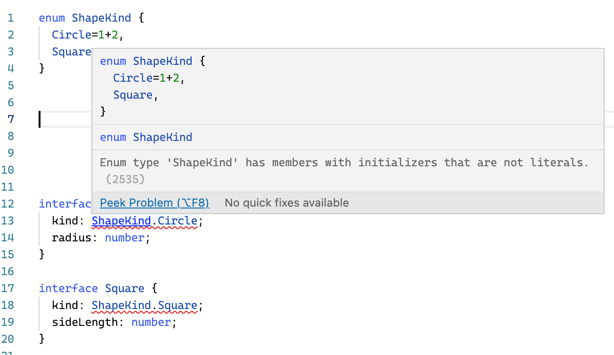
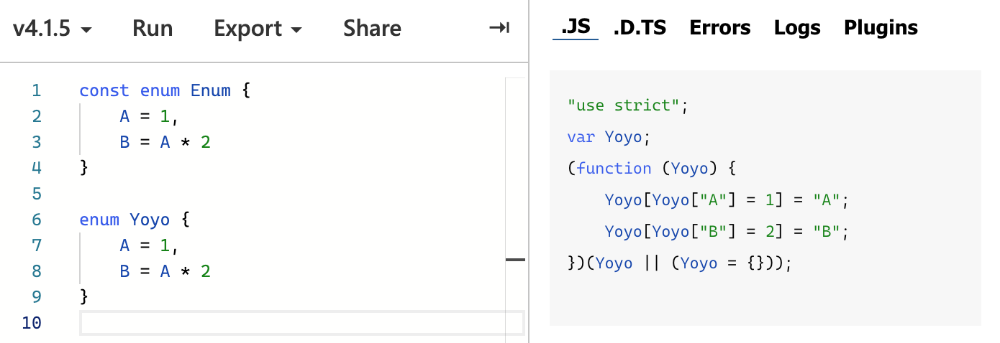

# 7. 열거형 (Enums)

## Enums란?

Enums 타입을 사용하면 **이름이 있는 상수들의 집합**을 정의할 수 있다. TS의 Enum은 JS에는 없는 개념이지만, Enum을 사용하면 의도를 보다 명료히 드러내거나, 명확한 경우들의 집합을 생성할 수 있다는 장점이 있다.

## Enums의 종류

Enums에는 숫자 열거형(**numeric** enums)과 문자 열거형(**string** enums)이 있다.

### 숫자 열거형 (Numeric enums)

#### 정의하기

숫자 열거형은 아래와 같이 정의한다.

```typescript
enum Direction {
  Up = 1, // Up은 1로 초기화 되었고, 이후의 멤버들은 자동으로 1씩 증가한 값을 가진다.
  Down, // 값 2
  Left, // 값 3
  Right // 값 4
}
```

반드시 초기화를 할 필요는 없다. 아래처럼 아예 초기화를 하지 않아도 무방하다.

```typescript
enum Direction {
  Up, // Up은 자동으로 0 값을 가진다
  Down, // 값 1
  Left, // 값 2
  Right // 값 3
}
```

이렇게 자동으로 값이 증가하는 숫자 열거형의 특징은, 멤버들의 값 자체는 중요하지 않되 값들이 서로 구분되어야 할 때 유용하다. 

#### 사용하기

enum을 사용할 때는 그냥 객체의 속성에 접근하듯 멤버에 접근하면 된다.

```typescript
enum Direction {
  Up = 1, 
  Down,
  Left,
  Right
}

function dummyFunc(d: Direction): void {
  // ...
}

dummyFunc(Direction.Up)
```

### String enums

문자열 열거형은 숫자 열거형과 유사하나, runtime에서 약간의 동작 차이를 가진다. 문자열 열거형은 enum 선언 시에 반드시 **상수로 초기화**되어야 한다. (문자열 리터럴이나, 다른 string enum 멤버로)

```typescript
enum Direction {
  Up = "UP",
  Down = "DOWN",
  Left = "LEFT",
  Right = "RIGHT",
}
```

문자열 열거형은 숫자 열거형처럼 자동 증가하는 속성은 없지만, 직렬화가 잘 된다는 장점이 있다. 숫자 열거형은 런타임에 멤버의 값을 파악하기가 어렵다. numeric enum에서는 멤버의 값 자체에는 큰 의미가 없기 때문에!

하지만 문자열 열거형은 의미 있는 리터럴 값 (혹은 다른 문자열 열거형의 멤버값)을 가지기 때문에, 코드를 실행할 때 의미 있고 readable한 값을 이용할 수 있다.

[참고개념: 데이터 직렬화]

- 데이터 직렬화(serialization): 메모리의 객체를 디스크에 저장하거나, 네트워크를 통해 전송되는 형식으로 변환하는 작업. 자바스크립트에서의 직렬화 예시는 `Object` 데이터 타입을 `JSON` 으로 변환하는 것이 있다. (ex. `JSON.stringify(obj)`)

- 데이터 역직렬화(deserialization): 디스크에 저장된 데이터를 읽거나, 네트워크를 통해 전송된 데이터를 받아서 메모리에 재구축하는 작업. (자바스크립트에서의 역직렬화 예시는 `JSON` 타입을 `Object`로 변환하는 것이 있다. (ex. `JSON.parse()`)

직렬화가 필요한 이유: 데이터를 디스크에 저장하거나 네트워크 통신에 사용하기 위해서는 `참조 형식` 데이터가 아닌, `값 형식` 데이터만 가능하기 때문이다.

저장/통신에 참조 형식 데이터를 사용하지 못하는 이유는, 참조 형식 데이터는 실제 데이터 값이 아니라, 힙에 할당되어 있는 메모리 번지 주소를 가지고 있기 때문이다.

출처: https://velog.io/@raram2/serialization / https://hub1234.tistory.com/26

### 숫자+문자열 열거형 (Heterogeneous enums)

```typescript
enum BooleanLikeHeterogeneousEnum {
  No = 0,
  Yes = "YES",
}
```

이렇게 섞어 쓸 수도 있긴 하지만 궂이...? 🙅‍♀️

### 계산된 멤버와 상수 멤버

enum member의 값에는 제한 조건이 있다. 1) **상수** 이거나, 2) **계산된** 값 이어야 한다.

[enum의 멤버가 상수로 간주되는 경우]

- 열거형의 **첫번째** 멤버이고, 초기화 되지 않은 경우: 0의 값을 할당받는다.

  ```typescript
  enum E {
  X, // E.X는 0의 값을 가진다. 즉, 상수로 간주된다.
  }
  ```

- 첫번째 멤버가 아니면서, 초기화 되지 않았고, 앞의 멤버가 numeric constant인 경우. 이 경우 숫자 열거형의 속성에 따라 앞 멤버+1의 값을 가진다.

  ```typescript
  // E2의 모든 멤버는 상수이다
  enum E2 {
  A = 1,
  B, // 값 2
  C, // 값 3
  }
  ```

- 멤버가 const enum expression으로 초기화 된 경우. `const enum expression`이란? 컴파일 타임에 완전히 평가될 수 있는 TS 표현식의 부분집합이다.  보다 세부적으로는 아래와 같다.

  - literal enum expression (스트링 리터럴, 숫자 리터럴) 
  - 앞서 정의된 상수 enum 멤버에 대한 참조 (다른 enum에서 참조하는 것도 가능)
  - 괄호로 묶인 constant enum expression
  - constant enum expression에 단항 연산자  `+`, `-`, `~` 를 사용한 경우
  - constant enum expression을 이중 연산자 `+`, `-`, `*`, `/`, `%`, `<<`, `>>`, `>>>`, `&`, `|`, `^` 의 피연산자로 사용할 경우

참고로, constant enum expression이 NaN이나 Infinity로 평가되는 것은 컴파일 에러다.

위의 케이스를 제외하면 enum member은 계산된 값(computed)으로 간주된다.

```typescript
enum FileAccess {
  // 아래 4개는 다 constant members
  None,
  Read = 1 << 1,
  Write = 1 << 2,
  ReadWrite = Read | Write,
  // 얘만 computed member
  G = "123".length,
}
```

## 유니언 열거형과 열거형 멤버 타입

(계산된 값이 아닌) 상수 enum 멤버 중, **리터럴 열거형 멤버**(literal enum members)라는 특수한 부분집합이 있다.

리터럴 열거형 멤버는 초기화된 값이 없거나, 아래와 같은 초기값을 가지는 멤버를 말한다.

- 스트링 리터럴 (ex. "foo")
- 숫자형 리터럴 (ex. 1)
- 숫자형 리터럴에 단항 연산자 `- ` 붙인 경우

참고) 숫자형 열거형의 속성에 따라 자동 증가된 값을 가지는 멤버도 리터럴 열거형 멤버로 간주되는 듯 하다. 🤯

만약 enum의 모든 멤버가 **리터럴 열거형 멤버**라면, 특수한 문법이 적용된다.

### 1 - enum의 멤버가 타입이 될 수 있다.

```typescript
// 이 ShapeKind 열거형 친구는 모든 멤버가 리터럴 열거형 멤버이므로, ShapeKind의 멤버를 타입으로 사용할 수 있다.
enum ShapeKind {
  Circle,
  Square,
}

interface Circle {
  kind: ShapeKind.Circle; // 이렇게 enum의 멤버를 타입으로 사용할 수 있다!
  radius: number;
}

interface Square {
  kind: ShapeKind.Square;
  sideLength: number;
}

let c: Circle = {
  kind: ShapeKind.Square, // 타입 에러! Type 'ShapeKind.Square' is not assignable to type 'ShapeKind.Circle'.
  radius: 100,
};
```

만약 ShapeKind의 모든 멤버가 리터럴 열거형 멤버가 아니였다면?

```typescript
enum ShapeKind {
  Circle = 1+2, // 리터럴 열거형 멤버가 아니다.
  Square,
}

interface Circle {
  kind: ShapeKind.Circle; // 에러! ShapeKind의 멤버를 타입으로 사용할 수 없다.
  radius: number;
}
```



### 2 - enum 타입 자체가 enum member 각각의 union이 된다.

enum의 모든 멤버가 **리터럴 열거형 멤버**인 경우를 유니언 열거형(Union enums)이라고도 할 수 있는데, 이 경우 enum type 자체가 enum 멤버의 union 타입처럼 동작한다.

따라서 TS 컴파일러가 미리 값을 예측할 수 있기 때문에 (?) 값을 실수로 잘못 비교하는 경우에 컴파일 타임에 에러를 잡을 수 있다.

```typescript
enum E {
  Foo,
  Bar,
}

function f(x: E) {
  // 에러! This condition will always return 'true' since the types 'E.Foo' and 'E.Bar' have no overlap.
  if (x !== E.Foo || x !== E.Bar) {
    // ...
  }
}
```

위 예제의 경우, 열거형 E의 멤버가 모두 리터럴 열거형이기에, E는 멤버의 union 타입처럼 동작한다. 

## 런타임에서의 열거형

Enums는 런타임에서 실제로 존재하는 **객체**이다. 따라서 함수의 파라미터로 전달될 수도 있다.

```typescript
enum E {
  X,
  Y,
  Z,
}

function f(obj: { X: number }) {
  return obj.X;
}

f(E) // 잘 동작한다.E는 X라는, 값이 0인 프로퍼티를 가지고 있기 때문에 
```

## 컴파일 타임에서의 열거형

런타임에서 enums가 실제 객체이긴 하지만, enum에 `keyof` 를 사용하면 일반적인 객체에 사용하는 `keyof` 와는 다르게 작동한다.

[참고 - `keyof` 란?]

keyof는 object 타입을 받아, 타입 값에 존재하는 모든 프로퍼티의 키값을 union 형태로 리턴해주는 type operator이다. [출처](https://medium.com/harrythegreat/typescript-%EC%9C%A0%ED%8B%B8%EB%A6%AC%ED%8B%B0-%ED%81%B4%EB%9E%98%EC%8A%A4-%ED%8C%8C%ED%97%A4%EC%B9%98%EA%B8%B0-7ae8a786fb20)

```typescript
type Point = { x: number; y: number };
type P = keyof Point; // type P = "x" | "y"
```

만약 enum 타입의 모든 멤버 키값을 union type으로 받고 싶다면, `keyof` 대신 `keyof typeof` 를 사용해야 한다.

```typescript
enum LogLevel {
  ERROR,
  WARN,
  INFO,
  DEBUG,
}

/**
 * This is equivalent to:
 * type LogLevelStrings = 'ERROR' | 'WARN' | 'INFO' | 'DEBUG';
 */
type LogLevelStrings = keyof typeof LogLevel;
```

### Reverse mapping

**숫자형 열거형 멤버**의 경우, enum value와 enum names에 대해 reverse mapping도 지원한다. 아래 예제를 보자!

```typescript
enum Enum {
  A,
}

let a = Enum.A;
let nameOfA = Enum[a]; // "A"
```

위 예제에서 `Eunm[a]`는 `Enum[Enum.A]` 와 같다. 즉, enum value를 가지고, 역으로 enum names에도 접근할 수 있는 것.

이런 reverse mapping이 가능한 이유는, enum이 컴파일 될 때 `name` > `value` 매핑을 저장할 뿐만 아니라 역으로 `value` > `name` 매핑도 저장하는 객체로 컴파일 되기 때문이다.

이런 Reverse mapping은 오직 숫자 열거형 멤버에 해당하는 이야기고, 문자열 열거형은 해당사항이 일절 없다.

### const 열거형 (const enums)

enums를 사용하면서 생길 수 있는 추가로 생성된 코드 및 추가적인 간접 참조에 대한 비용을 피하기 위해서 const 열거형을 사용할 수 이있다.

Const 열거형은 `const` 지정자를 enum 앞에 붙여 사용한다.

```typescript
const enum ExampleEnum {
  A = 1,
  B = A * 2
}
```

const enum은 일반적인 enum과는 달리, 컴파일 과정에서 완전히 제거되고, const enum을 사용하는 곳(use sites)에 인라인된다.



JS로 컴파일 된 결과를 보면 Enum은 완전히 사라진 것을 볼 수 있다.

이게 가능한 이유는, const enums가 computed 멤버를 가질 수 없기 때문이다.

[참고 - inline 함수란?]

## Ambient 열거형

Ambient 열거형은 이미 존재하는 enum type의 형태를 설명하기 위해 쓰인다.

```typescript
declare enum Enum {
  A = 1,
  B,
  C = 2
}
```

### Ambient enums과 Non-Ambient enums의 차이점

일반적인 enums에서는 **초기화되지 않은 멤버**라도 상수로 간주된 멤버 뒤에 있다면 **상수로 간주**된다. 하지만 const가 아닌 ambient 열거형에서는 초기화되지 않은 멤버는 항상 computed 멤버로 간주한다.

[참고 자료]

[TypeScript enum을 사용하는 이유](https://medium.com/@seungha_kim_IT/typescript-enum%EC%9D%84-%EC%82%AC%EC%9A%A9%ED%95%98%EB%8A%94-%EC%9D%B4%EC%9C%A0-3b3ccd8e5552)